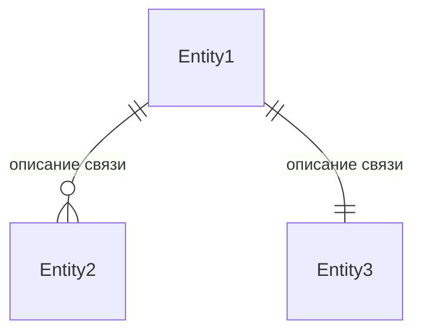
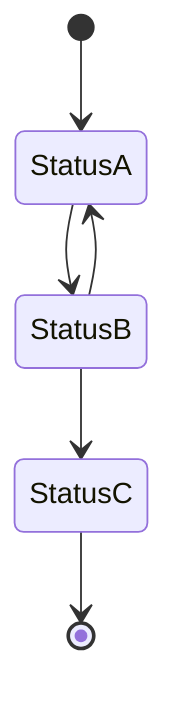

# Шаблон описания предметной области (Domain Record)

> Используйте этот шаблон для описания участка приложения с позиции бизнес-аналитика.
> Каждый Domain Record — отдельный файл в `docs/domain/`.

---

## 1. Бизнес-контекст

**Проблема / Возможность:**  
Какая бизнес-потребность привела к созданию этого участка?

**Цель:**  
Какую бизнес-ценность приносит эта фича? Что должно улучшиться?

**Пользователи / Роли:**  
- **Роль 1** — описание, права, частота использования
- **Роль 2** — описание, права, частота использования

**Ключевые метрики:**  
Какие KPI отслеживаем (конверсия, время выполнения, количество ошибок и т.д.)?

---

## 2. Сценарии использования

### 2.1 Основной сценарий (Happy Path)

| № | Участник | Действие | Результат |
|---|---|---|---|
| 1 | Роль | Описание действия | Что происходит в системе |
| 2 | Роль / Система | Описание действия | Что происходит в системе |
| 3 | Роль | Описание действия | Что происходит в системе |

### 2.2 Альтернативные сценарии

- **Сценарий A:** описание отклонения от happy path
- **Сценарий B:** описание отклонения от happy path

### 2.3 Исключительные ситуации (Error Path)

| Условие | Реакция системы |
|---|---|
| Что пошло не так | Как система должна обработать |
| Что пошло не так | Как система должна обработать |

---

## 3. Функциональные требования

> Пронумерованный список с приоритетом.

| ID | Требование | Приоритет | Примечание |
|---|---|---|---|
| FR-01 | Система должна ... | Must have | |
| FR-02 | Пользователь должен иметь возможность ... | Should have | |
| FR-03 | Система должна отображать ... | Must have | |

---

## 4. Нефункциональные требования

| ID | Требование | Значение / Описание |
|---|---|---|
| NFR-01 | Время отклика | не более X мс |
| NFR-02 | Максимальное количество одновременных пользователей | X |
| NFR-03 | Безопасность | описание требований к авторизации, шифрованию и т.д. |
| NFR-04 | Доступность | SLA, время восстановления |

---

## 5. Бизнес-правила

1. **Правило 1:** Формулировка ограничения или условия.
2. **Правило 2:** Формулировка ограничения или условия.
3. **Правило 3:** Формулировка ограничения или условия.

---

## 6. Модель данных (логическая)

### Сущности

| Сущность | Описание | Ключевые атрибуты |
|---|---|---|
| `EntityName` | Описание сущности | `id`, `field1`, `field2`, ... |

### Связи

### Статусная модель (жизненный цикл)

---

## 7. API-контракты (со стороны бэкенда)

> Описание ключевых эндпоинтов с позиции БА — что принимают, что отдают, для чего.

| Метод | Путь | Назначение | Параметры |
|---|---|---|---|
| GET | /api/v1/resource | Получить список | `?filter=...` |
| POST | /api/v1/resource | Создать | тело запроса |
| PATCH | /api/v1/resource/:id | Обновить | тело запроса |
| DELETE | /api/v1/resource/:id | Удалить | |

---

## 8. Критерии приёмки (Acceptance Criteria)

> Условия, при которых фича считается готовой.

- [ ] AC-01: ...
- [ ] AC-02: ...
- [ ] AC-03: ...

---

## 9. Вопросы и допущения

**Вопросы:**
1. Не уточнено ...
2. Требуется решение ...

**Допущения:**
1. Считаем, что ...
2. Считаем, что ...

---

## 10. Зависимости

- **Внешние системы:** интеграция с сервисом X, Y
- **Внутренние модули:** модуль A, модуль B
- **Инфраструктура:** требуется БД, очередь сообщений и т.д.

---

## История изменений

| Версия | Дата | Автор | Изменение |
|---|---|---|---|
| 1.0 | ГГГГ-ММ-ДД | Имя Фамилия | Начальная версия |
