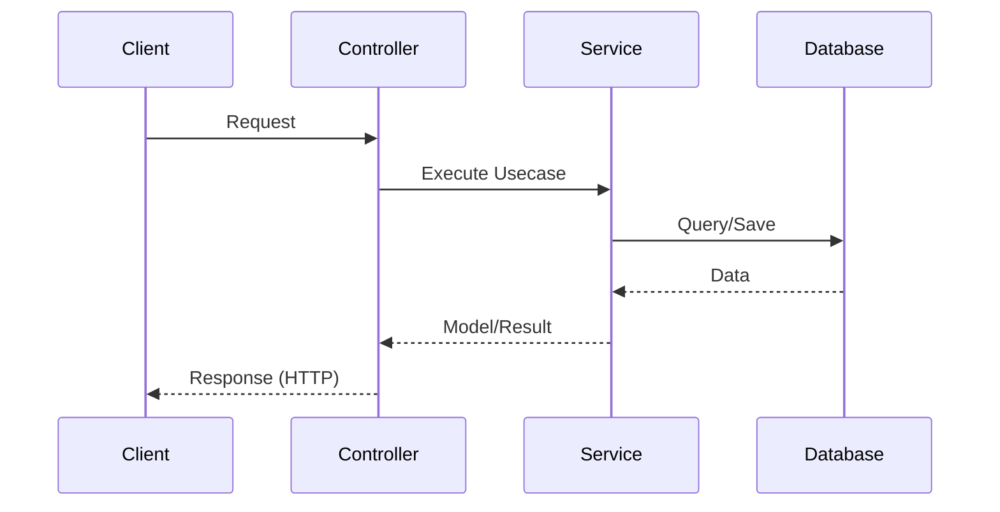

---
id: FE-{NNN}
title: "Краткое название технического решения / фичи"
module: "Название модуля (например, Конфигурация ВС, Техническое обслуживание)"
author: "Имя Фамилия"
created_at: "ГГГГ-ММ-ДД"
updated_at: "ГГГГ-ММ-ДД"
status: "draft | review | approved | deprecated"
version: 1.0
tags:
  - тег1
related_domain_records:
  - DR-{NNN}
related_test_cases:
  - TC-{NNN}
---
# Шаблон описания технической реализации фичи (Feature Specification)

> Используйте этот шаблон для детального описания технического дизайна и плана реализации фичи.
> Каждое описание технического решения фичи — отдельный файл в `docs/features/`.

---

## 1. Контекст и бизнес-цель

Кратко опишите, какую проблему решает фича и какую пользу она приносит. Ссылайтесь на бизнес-требования (Domain Records) или задачи в трекере.

---

## 2. Архитектурное решение

Опишите концепцию технического решения:

- Какие модули и слои затрагиваются.
- Общая схема взаимодействия компонентов.
- Диаграммы взаимодействия (при необходимости).



---

## 3. Схема базы данных (Prisma)

Опишите изменения в схеме базы данных: новые модели, поля, индексы, связи и стратегию удаления.

Схема в [aircraft-configuration.prisma](../prisma/schema/models/aircraft-configuration.prisma) (или другом prisma-файле):

```prisma
// Пример новой модели
model ExampleModel {
  id        String   @id @default(uuid()) @db.Uuid
  createdAt DateTime @default(now()) @map("created_at") @db.Timestamptz()
  
  @@map("example_table")
}
```

---

## 4. Алгоритмы и вспомогательные функции

Опишите сложные вычисления, структуры данных или вспомогательные функции, используемые в реализации.

---

## 5. API-контракты и DTO

Опишите изменения в REST API или DTO.

### Новые или измененные эндпоинты

| Метод | Путь            | Описание                | Роли / Доступ |
| ---------- | ------------------- | ------------------------------- | ----------------------- |
| POST       | `/api/v1/example` | Создание примера | Admin                   |

### Схема DTO и валидация

Опишите поля входных и выходных DTO, используемые валидаторы (`class-validator`) и трансформации (`class-transformer`).

---

## 6. Обработка ошибок (Error Handling)

Опишите возможные ошибки и бизнес-исключения, которые могут возникнуть в процессе выполнения.

| Исключение (Error Case) | HTTP статус | Сообщение об ошибке | Причина                                 |
| --------------------------------- | ----------------- | ------------------------------------ | ---------------------------------------------- |
| `ErrorCase.Conflict`            | 409 Conflict      | `Detailed error message`           | Попытка создать дубликат |

---

## 7. План реализации

Пошаговое описание задач для разработки фичи:

- [ ] **Шаг 1:** Описание задачи 1
- [ ] **Шаг 2:** Описание задачи 2
- [ ] **Шаг 3:** Описание задачи 3

---

## 8. Тестирование

### Unit-тесты

- Какие функции и методы должны быть покрыты модульными тестами.
- Ожидаемые граничные случаи для тестирования.

### E2E-тесты

- Инструкция по запуску интеграционных/E2E-тестов.
- Перечень сценариев, которые необходимо покрыть в E2E-тестах.

---

## История изменений

| Версия | Дата           | Автор            | Изменение              |
| ------------ | ------------------ | --------------------- | ------------------------------- |
| 1.0          | ГГГГ-ММ-ДД | Имя Фамилия | Начальная версия |
