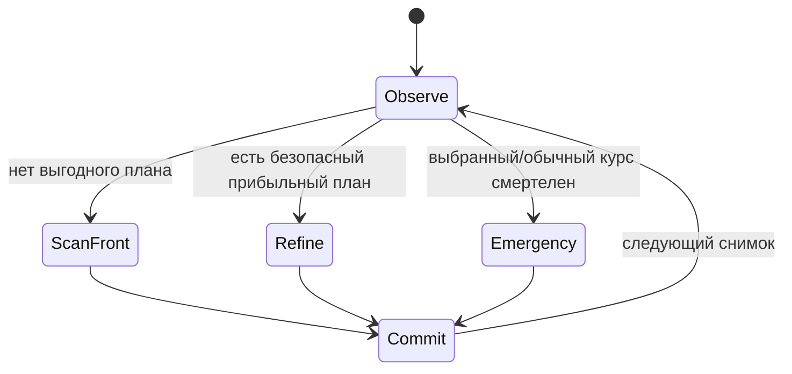

# DR-001: Автономная стратегия игрока по прогнозу траекторий

## 1. Бизнес-контекст

Игроку нужен автономный клиент, который управляет всеми своими транспортами, собирает bounties и избегает гибели от аномалий, других ковров и выхода за карту. Стратегия является клиентским кодом и не включается в бинарник сервера.

Цель — выбирать команды по прогнозируемому результату траектории, а не только по ближайшей монете. Главные метрики — очки за время, доля выживших транспортов и доля реально собранных монет из выбранных целей.

## 2. Сценарии использования

Стратегия `stable-profit` остаётся основной по умолчанию: закрепляет прибыльный перехват, проверяет ETA и ищет краткие детуры. Альтернативная `agile-top1` каждый тик пересчитывает круг вариантов и сразу применяет ускорение лучшей на текущем снимке траектории; фиксации цели и цены непрерывности направления в ней нет. Обе стратегии сохраняют инварианты: безопасность выше награды, команде живого ковра соответствует ненулевой вектор длиной `maxAccel`.

### 2.1 Основной сценарий

| № | Участник | Действие | Результат |
|---|---|---|---|
| 1 | Бот | Опрос состояния Desert по своему токену | Получает личные транспорты, bounties, аномалии и лимиты мира |
| 2 | Бот | Строит прогноз движения каждого живого транспорта | На каждом тике учитываются Euler, трение, maxSpeed и будущие положения аномалий |
| 3 | Бот | Сканирует направления максимального ускорения и ранжирует траектории | Учитываются собираемые монеты и смертельные события |
| 4 | Бот | Отправляет пакет команд следующим запросом к тому же endpoint | Сервер принимает до одной пакетной команды на тик; каждый живой ковер имеет ненулевое ускорение и явную цель |

### 2.2 Альтернативные сценарии

- Хороший безопасный курс сохраняется с гистерезисом; детальный поиск сосредоточен вокруг него, менее плотный — по бокам, редкий — позади.
- `stable-profit` сканирует круг с шагом 5° и уточняет лидеров с шагом 0,25°; `agile-top1` выполняет этот обзор заново каждый тик без удержания предыдущего курса.
- Если ни одна кандидатная траектория не выживает, выбирается скорейшее прогнозируемое смертельное событие; bounty, достижимые до него, повышают приоритет такого курса.
- Для каждого живого ковра на каждом цикле выбирается ровно одна цель: собрать монеты по траектории, избежать смерти любой ценой или, если выживание невозможно в проверенном горизонте, умереть как можно скорее.
- В цели смерти монеты, собираемые до гибели, остаются предпочтительным дополнительным результатом; при цели избегания смерти награда не может перевесить безопасность.
- Первая фактически собираемая монета безопасного текущего курса фиксирует точный вектор ускорения до сбора/исчезновения; дальняя цель не теряет фиксацию только из-за расстояния, если остаётся в горизонте прогноза. После подтверждённого сбора бот немедленно снимает commitment и выбирает лучший безопасный новый курс.
- Фиксация цели контролируется по ETA именно закреплённой bounty: ожидаемое время должно уменьшаться примерно на длительность прошедшего тика. Два последовательных тика без такого прогресса снимают фиксацию и запускают новый выбор.
- Пока базовый дальний маршрут удерживается, короткий тактический веер ищет ближайшую bounty с существенно более высоким первым `points/ETA`. Временный безопасный перехват хранит прежний курс только как дополнительный кандидат. После сбора перехваченной монеты планировщик заново сравнивает лучшие варианты по текущему состоянию; прежний курс может победить только по результатам этого сравнения и не восстанавливается автоматически.
- Безопасность проверяется на полном горизонте 30 секунд, в том числе для временных ближних перехватов. Любой безопасный маршрут без монет предпочтительнее любого смертельного маршрута.
- Если транспорта нет в живом статусе, он не получает ускорение; бот продолжает опрос, чтобы обнаружить респавн.
- В `agile-top1` planning horizon по умолчанию 15 секунд и не может быть увеличен выше 15 секунд; каждые 200 мс выбирается новый top-1 безопасный маршрут по актуальному состоянию. Модель не удерживает прошлую цель/траекторию: отправляемый вектор полного ускорения — управляющее действие первого шага лучшего маршрута (receding-horizon control).

### 2.3 Исключения

| Условие | Реакция |
|---|---|
| API отвечает 429 | Не повторять команду в том же тике; дождаться следующего тика и повторить пакет |
| API/сеть временно недоступны | Сохранить последний выбранный план, выдержать паузу и повторить опрос |
| Нет bounties | Выбирать безопасную траекторию с движением к внутренней части карты |
| Неизвестное или неполное поле ответа | Не отправлять некорректные команды; повторить опрос. Для разобранного живого ковра нулевое ускорение запрещено |

## 3. Функциональные требования

| ID | Требование | Приоритет | Примечание |
|---|---|---|---|
| FR-01 | Клиент должен использовать только Desert API и токен игрока. | Must have | `POST /play/magcarp/player/move` |
| FR-02 | Для каждого живого транспорта строится прогноз по серверным Euler, трению, maxAccel и maxSpeed. | Must have | Силы аномалий пересчитываются в будущих координатах ковра и аномалий |
| FR-03 | Каждый живой ковер оценивает все направления полного круга, затем уточняет лучшие локальные области. | Must have | Обзор 360° шагом 5° (72 кандидата); до трёх разнесённых лидеров уточняются в окнах ±3° шагом 0,25°; слепой зоны сзади нет |
| FR-04 | Безопасные траектории ранжируются по ожидаемым bounty points, числу монет и риску. | Must have | Избегать ядра, ковров и границ карты |
| FR-05 | Ускорение отправляется длиной ровно `maxAccel`; решение обновляется каждый тик. | Must have | Масштаб команды не является регулятором скорости |
| FR-06 | Учитывается измеренная/сглаженная задержка сети и время до следующего тика. | Must have | Проекция текущего состояния до момента действия новой команды |
| FR-07 | При неизбежной гибели выбирается самый короткий путь к смерти с учетом bounty на пути. | Should have | Для сокращения пустого ожидания до респавна |
| FR-08 | План удерживается между тиками и корректируется по фактическому движению и факту исчезновения bounty. | Must have | Гистерезис предотвращает метание между курсами |
| FR-09 | Каждый живой ковер на каждом цикле получает явный режим цели: сбор монет, избегание смерти или кратчайшая смерть при отсутствии выживаемой траектории. | Must have | Режим и направление не могут оставаться неопределёнными |
| FR-10 | Ускорение каждого живого ковра в отправляемом пакете ненулевое. | Must have | В нормальном мире длина равна `maxAccel`; некорректный нулевой лимит использует минимальный ненулевой fallback |
| FR-11 | Выбор добычи учитывает `total potential score` и `time to reach score`. | Must have | Сумма ожидаемых очков с временным discount и время до первой награды |
| FR-12 | Траектория к первой реально собираемой монете не меняется из-за малой разницы оценки или микрокоррекции. | Must have | Точный вектор удерживается до сбора; раньше только если путь стал опасен или перестал попадать в цель |
| FR-13 | Любая живая команда использует ускорение длиной `maxAccel`; прогнозируемые курсы сравниваются по поддержанию/набору скорости к `maxSpeed`. | Must have | Включая сбор монет, бегство и кратчайшую смерть |
| FR-14 | Угловой скан уточняется для надёжного пересечения bounty; случайная микровыигрышная смена направления подавляется. | Must have | Локальная доводка субградусным шагом; near-miss бонус не засчитывается за сбор |
| FR-15 | При продолжающемся безопасном перехвате бот удерживает направление ускорения и переключается на резкий манёвр только при существенной выгоде, угрозе или недоступности цели. | Must have | Фактическое пересечение bounty и достижимая текущая цель важнее микроскопической разницы скорости |
| FR-16 | Для каждого курса считается прибыльность в score/секунду до последней собираемой на нём bounty при общем шаге симуляции; прибыльный текущий курс захватывается до конца, если новая траектория не даёт существенного прироста. | Must have | Нулевая прибыль не блокирует выбор любого положительно-прибыльного безопасного курса; безопасность выше commitment |
| FR-17 | Прогресс закреплённой цели измеряется по ETA этой конкретной bounty между серверными тиками. | Must have | ETA должно сокращаться с учётом прошедшего времени; два последовательных отсутствия прогресса запускают перебор курса |
| FR-18 | Бот проверяет временные безопасные перехваты близких bounty, не теряя основную цель. | Must have | Тактический горизонт 5 с; полный горизонт безопасности 30 с; условие выгоды — первый `points/ETA` лучше базового минимум на `max(50%, 5 points/s)` |
| FR-19 | После временного перехвата бот повторно выбирает маршрут из лучших актуальных вариантов. | Must have | Исходные угол и bounty повторно прогнозируются как обычный кандидат, но не получают безусловного приоритета |
| FR-20 | Aim и movement — независимые стратегии, обе активны каждый тик; сбор bounty сохраняет приоритет, пока траектория не входит в фатальную ячейку в пределах горизонта планирования. | Must have | `DATS_PLAYER_STRATEGY` и `DATS_MOVEMENT_STRATEGY`; компенсируемое давление само по себе не запускает уход |
| FR-21 | Survival movement избегает некомпенсируемых зон притяжения/выталкивания и силовых цепочек в них; компенсируемый риск не влияет на выбор. Среди безопасных курсов предпочитает выживаемый сбор bounty. | Must have | Шаг risk-grid — 350 единиц; нефатальная risk exposure — только телеметрия |
| FR-22 | Когда scan не находит курса, переживающего safety horizon, doom policy выбирает сбор доступных bounty до смерти либо кратчайшую смерть. | Must have | `DATS_DOOM_POLICY=collect|fastest` |

## 4. Нефункциональные требования

| ID | Требование | Значение / Описание |
|---|---|---|
| NFR-01 | Изоляция сборки | Бот собирается как отдельный бинарник и не добавляет модули в сервер |
| NFR-02 | Быстродействие | Кандидатные траектории рассчитываются на Rust без лишних сетевых/асинхронных зависимостей |
| NFR-03 | Сетевой темп | Не более одной попытки с командами за серверный тик; 429 обрабатывается backoff-ом |
| NFR-04 | Воспроизводимость | Число секторов, горизонт, шаг физики, веса score и сетевой фильтр задаются конфигурацией |

## 5. Бизнес-правила

1. API transport-команд использует Desert payload и заголовок `X-Auth-Token`; серверная реализация API остаётся внешним интерфейсом, а стратегия player_2 принадлежит только игроку.
2. Bounty собирается, если отрезок движения центра ковра за серверный тик касается круга монеты: минимальное расстояние от центра bounty до отрезка не больше суммы `transportRadius + bounty.radius` (сейчас 10); ценность равна `points`. Проверка только конечной точки тика недостаточна.
3. Аномалия с `strength > 0` притягивает, с `strength < 0` отталкивает; сила действует внутри зоны влияния, касание ядра смертельно.
4. Прогноз использует шаг игрового тика `0.2s`, коэффициент трения `0.98`, а `maxAccel` и `maxSpeed` берёт из снимка мира. Кандидатные команды имеют длину `maxAccel`.
5. Смертельны касание ядра с учётом радиуса транспорта, столкновение с другим транспортом и выход за границы карты.
6. Предсказанная гибель завершает кандидатную траекторию; учитываются только bounty до столкновения.
7. Задержка учитывается проекцией текущего ускорения до применения команды; RTT сглаживается EWMA.
8. Каждый основной скан равномерно покрывает 360° вокруг текущего направления движения шагом 5° (72 направления); это включает резкое ускорение назад. До трёх разнесённых лучших областей уточняются полным горизонтом шагом 0,25° в окнах ±3°. Пока подтверждённая безопасная цель удерживается, её точное направление повторно проверяется и полный скан пропускается.
9. Поскольку основной скан уже проверяет полный круг, дополнительный аварийный обзор не нужен. Если безопасного направления нет — выбирается кратчайшая прогнозируемая смерть, с предпочтением bounty на её пути.
10. Для каждого живого ковра выбирается ровно одна цель: `CollectBounties`, если безопасная траектория собирает bounty; `AvoidDeath`, если безопасная траектория не собирает bounty; `FastestDeath`, если весь проверенный аварийный обзор смертелен.
11. `AvoidDeath` приоритетнее любой награды. `FastestDeath` сначала минимизирует время гибели, затем учитывает points на пути. Команда любого живого ковра ненулевая; мёртвые ковры ждут респавна.
12. `totalPotentialScore` равен сумме дисконтированных points всех bounty на прогнозируемой траектории плюс оценка достижимой ближайшей bounty; `timeToReachScore` — время до первой фактической награды или до ближайшего прогнозируемого сближения, включая сетевой lead. `firstBountyRate` — points первой фактически собираемой bounty / её ETA; эта локальная метрика применяется только для выбора короткого выгодного перехвата.
13. Среди безопасных курсов используется `targetUtility = totalPotentialScore + 5 * exp(-timeToReachScore / 15) - courseChangeCost`. Цена курса растёт с углом отклонения; микроскопическая разница скорости внутри допуска сравнения не переключает ускорение.
14. Если безопасная сохранённая траектория собирает закреплённую bounty в пределах горизонта прогнозирования, проверяется её ETA в каждом тике. Удержание сохраняется, пока цель собирается и ETA прогрессирует; два последовательных тика без сокращения ETA сверх допуска 0,12 с снимают commitment и запускают полный выбор курса. Смертельный или переставший попадать в цель путь освобождается сразу.
15. Для всех целей команда имеет модуль `maxAccel`; внутри одного класса безопасности сохраняется приоритет скорости, но отличие средней скорости до 1,5% считается шумом и сравнивается через пользу цели и преемственность курса. Для смертельных траекторий приоритет скорости строгий, затем выбирается минимальное время до столкновения.
16. Угловой запас поиска повышает вероятность точного наведения; near-miss бонус в пределах 18 единиц за capture-radius влияет только на потенциальную оценку и не считается фактически собранной bounty.
17. При удержании безопасной цели дополнительно запускается тактический 360° scan шагом 10° на горизонт 5 с и локальным уточнением лидеров шагом 0,25°. Он ищет фактически собираемые близкие bounty с `firstBountyRate`, существенно превосходящим rate основной цели; кандидат подтверждается отдельным прогнозом полного 30-секундного горизонта.
18. Выгодный ближний курс оформляется как одноразовый detour: исходная пара «угол + bounty» сохраняется только для включения в последующий набор кандидатов. После подтверждённого сбора detour-bounty выполняется новый выбор среди актуальных лучших вариантов; прежний маршрут оценивается заново на текущем снимке и не получает безусловного приоритета. Одновременно может существовать только один detour.
20. Длинный `scoreRate` остаётся суммой points / времени до последней монеты маршрута и не подменяется тактической `firstBountyRate`. ETA закреплённой bounty сохраняется отдельно от score-rate полного маршрута.
21. Планировщик выводит длительность планирования и сетевого RTT, долю 200-мс тикового бюджета, суммарное время цикла и оценку числа рассчитанных маршрутов/интеграционных шагов; превышения бюджета считаются и отображаются для диагностики.
20. Внешняя сила аномалии складывается с управляющим ускорением, но не глушит его: каждая команда живого ковра имеет модуль `maxAccel`, а физический сервер применяет её независимо от нахождения в зоне аномалии. Фактический результат движения может отличаться из-за суммы векторов и ограничения скорости.
21. При активной краткосрочной аренде `manual_control_<token-hash>.json` от визуализатора player_2 не обращается к игровому API и очищает отложенные команды; после освобождения аренды он начинает с нового снимка, чтобы процессы с общим токеном не перезаписывали команды друг друга.

## 6. Модель данных

| Сущность | Ключевые атрибуты |
|---|---|
| `DesertSnapshot` | `mapSize`, `maxAccel`, `maxSpeed`, `transportRadius`, `transports`, `anomalies`, `bounties`, `enemies` |
| `CandidatePath` | heading, positions, expected bounty points/count, survival time, first death reason |
| `TransportPlan` | selected heading, explicit goal mode, bounty target coordinate/value, target ETA and no-progress ticks, optional resume candidate (prior heading + bounty), smoothed RTT |
| `Strategy` | `stable-profit` (default, commitment and detours); `agile-top1` (stateless rescoring each tick, horizon ≤15 s) |

## 7. API-контракты

| Метод | Путь | Назначение | Параметры |
|---|---|---|---|
| POST | `/play/magcarp/player/move` | Получение Desert и пакет команд | `X-Auth-Token`; `{ "transports": [{"id":"…", "acceleration":{"x":…, "y":…}}] }` |

Опрос без команд — `{ "transports": [] }`; состояние и команда используют один маршрут.

## 8. Критерии приемки

- [ ] AC-01: Игрок `player_2` самостоятельно регистрируется и управляет только своим флотом из 5 транспортов.
- [ ] AC-02: Прогноз кандидатов совпадает с серверной формулой Euler на фиксированных состояниях.
- [ ] AC-03: Каждый живой ковер на каждом цикле имеет ровно одну цель из трех заданных; безопасность не проигрывает награде.
- [ ] AC-04: У каждого живого ковра в запросе всегда ненулевой вектор ускорения.
- [ ] AC-05: RTT измеряется и используется для проекции команды.
- [ ] AC-06: Бинарник бота собирается отдельно от сервера.
- [ ] AC-07: Снимок для player_1 остается копией исходного datsmagic, его ключ `player_1`.
- [ ] AC-08: `DATS_PLAYER_STRATEGY` переключает `stable-profit` и `agile-top1`; второй режим каждый тик выбирает актуальный top-1, не сохраняет commitment и не превышает горизонт 15 секунд.

## 9. Вопросы и допущения

**Допущения:**
1. Сильное ускорение поддерживается постоянной длины `maxAccel`, но направление выбирается заново после каждого снимка.
2. Будущие позиции противников для прогноза считаются линейными по последней скорости; неизвестные команды противника не угадываются.
3. Кандидатный прогноз ограничен конечным горизонтом, чтобы бот мог пересматривать решение каждый серверный тик.

## 10. Контекст и интерфейсы

- Игровой контекст и формат Desert API являются внешней средой для этого отдельного игрока.
- Доменная стратегия, выбор целей и планирование траекторий принадлежат player_2 и не являются частью логики сервера.
- Реализация расположена в `lib/bot-variants/player_2`.

## История изменений

| Версия | Дата | Автор | Изменение |
|---|---|---|---|
| 1.0 | 2026-10-02 | Codex | Формализация клиентского планировщика траекторий флота. |
| 1.1 | 2026-10-02 | Codex | Зафиксированы обязательные цели и ненулевое ускорение; запись перенесена в документацию player_2. |
| 1.2 | 2026-10-02 | Codex | Нумерация локальной предметной области начата с DR-001; зафиксированы шаги и охват углового скана. |
| 1.3 | 2026-10-02 | Codex | Зафиксированы full-accel/max-speed приоритет, более плотная дискретизация и near-miss bonus. |
| 1.4 | 2026-10-02 | Codex | Уточнены адаптивная слепая зона, субградусное наведение на монеты и гистерезис устойчивого направления. |
| 1.5 | 2026-10-02 | Codex | Добавлена метрика score/сек и фиксация прибыльного курса с порогом переключения. |
| 1.6 | 2026-10-02 | Codex | Score-rate уточнён как реальные points на время до последней монеты отдельного маршрута; near-miss исключён из заработанного score. |
| 1.7 | 2026-10-02 | Codex | Основной детальный скан расширен с 270° до равномерных 360° при шаге 2°. |
| 1.8 | 2026-10-02 | Codex | Зафиксировано, что аномалии не отключают командное ускорение; телеметрия разделяет A_now и A_next. |
| 1.9 | 2026-10-02 | Codex | Детализация равномерного скана полного круга увеличена до 0,5° (720 направлений). |
| 1.10 | 2026-10-02 | Codex | Усилен гистерезис курса по score-rate: безопасный курс удерживается до существенного прироста прибыльности. |
| 1.11 | 2026-10-02 | Codex | Первая собираемая монета фиксирует траекторию до сбора; затем курс немедленно выбирается заново. |
| 1.12 | 2026-10-02 | Codex | Сбор монет синхронизирован с endpoint-проверкой сервера; скан уплотнён до 0,25°, добавлены метрики бюджета тика. |
| 1.13 | 2026-10-02 | Codex | Установлен двухэтапный полный круговой scan и удержание подтверждённого курса без повторного веера для снижения времени планирования. |
| 1.14 | 2026-10-02 | Codex | Захват bounty согласован с сервером: касание суммы радиусов на swept-сегменте за тик. |
| 1.15 | 2026-10-02 | Codex | Добавлены прогресс ETA закреплённой монеты, короткий поиск прибыльных детуров и возврат к базовому курсу при приоритете выживания. |
| 1.16 | 2026-10-02 | Codex | После detour зафиксирован новый выбор среди актуальных кандидатов вместо автоматического возврата. |
| 1.17 | 2026-10-02 | Codex | Основная стратегия названа `stable-profit`; добавлен режим `agile-top1` без удержания и с горизонтом до 15 секунд. |
| 1.18 | 2026-10-02 | Codex | Aim и movement выделены в независимые классы с safety override и переключаемой политикой при не найденном выходе. |
