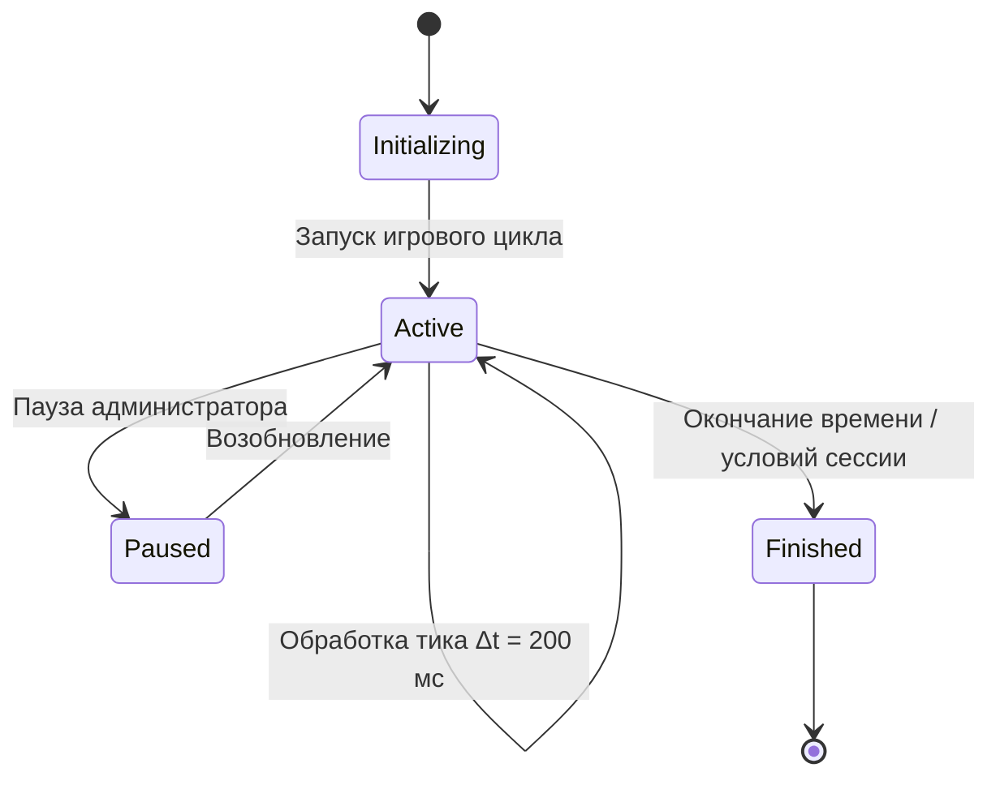

# DR-001: Игровой цикл и синхронизация состояния мира (Game Loop & World State)

## 1. Бизнес-контекст

**Проблема / Возможность:**  
Для проведения соревновательной симуляции DatsMagic требуется детерминированный серверный цикл времени, обеспечивающий синхронизацию действий всех участников и корректный сбор команд управления без состояния гонки (race conditions).

**Цель:**  
Обеспечить циклическое продвижение игрового времени с фиксированным интервалом $\Delta t = 0.2$ с (200 мс), атомарную обработку команд игроков за тик и предоставление целостного снапшота состояния мира для клиентов и системы визуализации.

**Пользователи / Роли:**  
- **Игровой агент (Бот команды)** — отправляет вектор ускорения ковра раз за тик, считывает состояние мира.
- **Клиент визуализации** — периодически запрашивает снимок мира для отображения.
- **Серверный движок (Game Master)** — управляет счетчиком тиков, транзакциями ввода и фазами симуляции.

**Ключевые метрики:**  
- Дрейф времени тика: не более $\pm 2$ мс от шага 200 мс.
- Успешность синхронизации команд: 100% принятых команд за тик должны быть применены в следующем физическом шаге.

---

## 2. Сценарии использования

### 2.1 Основной сценарий (Happy Path)

| № | Участник | Действие | Результат |
|---|---|---|---|
| 1 | Сервер | Запускает таймер тика $\Delta t = 200$ мс | Начинается прием команд в буфер тика $N$ |
| 2 | Игрок | Отправляет управляющую команду `POST /api/carpet/command` | Команда регистрируется в буфере тика $N$ |
| 3 | Таймер сервера | Срабатывает событие истечения 200 мс | Буфер команд тика $N$ закрывается |
| 4 | Сервер | Передает команды в модули физики и коллизий | Выполняется расчет новых координат и состояний |
| 5 | Сервер | Инкрементирует номер тика ($N \to N+1$), формирует снапшот | Новое состояние доступно через `GET /api/game/state` |

### 2.2 Альтернативные сценарии

- **Сценарий A (Игрок не отправил команду за тик):** Вектор управляющего ускорения для данного игрока принимается равным $\vec{A} = (0, 0)$. Ковёр движется по инерции с учетом трения и внешних сил.
- **Сценарий B (Повторная команда за один тик):** Сервер отклоняет повторные запросы в рамках одного тика с HTTP 429 Too Many Requests (или перезаписывает команду в зависимости от политики Rate Limit).

### 2.3 Исключительные ситуации (Error Path)

| Условие | Реакция системы |
|---|---|
| Запрос к API с недействительным токеном | HTTP 401 Unauthorized, команда игнорируется |
| Запрос команды с невалидным телом (NaN, Infinity, строковые поля) | HTTP 400 Bad Request, буфер команд не модифицируется |
| Превышение времени выполнения физического пересчета | Логирование предупреждения о перегрузке тика, пропуск задержки для догона реального времени |

---

## 3. Функциональные требования

| ID | Требование | Приоритет | Примечание |
|---|---|---|---|
| FR-01 | Сервер должен поддерживать строго периодический цикл с шагом тика $\Delta t = 0.2$ с (5 тиков в секунду). | Must have | Единственный источник игрового времени |
| FR-02 | Сервер должен буферизовать управляющие команды, поступающие от игроков в течение тика. | Must have | Атомарное применение в конце тика |
| FR-03 | Сервер должен предоставлять эндпоинт `GET /api/game/state` с полной картиной текущего тика. | Must have | Снапшот содержит игрока, сокровища, аномалии, врагов |
| FR-04 | Сервер должен инкрементировать целочисленный счетчик `tick` при каждом завершении шага симуляции. | Must have | Монотонно возрастающее значение |
| FR-05 | Сервер должен ограничивать прием команд: не более 1 команды от одной команды за тик. | Must have | Предотвращение спама |

---

## 4. Нефункциональные требования

| ID | Требование | Значение / Описание |
|---|---|---|
| NFR-01 | Время отдачи снапшота состояния мира | Не более 5 мс по `GET /api/game/state` |
| NFR-02 | Стабильность игрового такта | Дисперсия длительности тика не более 2 мс |
| NFR-03 | Изоляция потоков | Запросы API не должны блокировать цикл физического пересчета (Read-Copy-Update или `RwLock`) |
| NFR-04 | Потокобезопасность | Все мутации состояния выполняются строго в конце тика в критической секции |

---

## 5. Бизнес-правила

1. **Правило атомарности тика:** Все изменения координат и состояний происходят дискретно в момент перехода между тиками.
2. **Правило буферизации ввода:** Команда, поступившая в тике $N$, влияет на физический пересчет между тиком $N$ и $N+1$.
3. **Правило актуальности снапшота:** Клиент всегда получает состояние мира, соответствующее последнему завершенному тику.

---

## 6. Модель данных (логическая)

### Сущности

| Сущность | Описание | Ключевые атрибуты |
|---|---|---|
| `GameSession` | Глобальный контекст симуляции | `tick: u64`, `status: SessionStatus`, `started_at: Timestamp` |
| `CommandBuffer` | Очередь поступивших команд тика | `commands: Map<PlayerId, AccelerationCommand>` |
| `WorldSnapshot` | Неизменяемый снимок состояния мира | `tick`, `player`, `treasures`, `anomalies`, `enemies` |

### Статусная модель игры

---

## 7. API-контракты (со стороны бэкенда)

| Метод | Путь | Назначение | Параметры |
|---|---|---|---|
| GET | `/api/game/state` | Получение текущего состояния мира для авторизованного игрока | Заголовок `X-Auth-Token` |
| POST | `/api/carpet/command` | Отправка команды ускорения ковра на текущий тик | Заголовок `X-Auth-Token`, тело JSON `{ "acceleration": { "x", "y" } }` |

---

## 8. Критерии приёмки (Acceptance Criteria)

- [x] AC-01: Цикл симулятора непрерывно генерирует события тиков с интервалом 200 мс.
- [x] AC-02: Запрос `GET /api/game/state` возвращает валидный JSON, содержащий актуальный `tick` и данные всех сущностей.
- [x] AC-03: Команда ускорения через `POST /api/carpet/command` успешно регистрируется и передается в физический движок.
- [x] AC-04: При отправке второй команды в одном тике сервер возвращает HTTP 429.

---

## 9. Вопросы и допущения

**Допущения:**
1. Сервер держит состояние исключительно в оперативной памяти (In-Memory).
2. Авторизация игроков осуществляется по статическому токену из заголовка `X-Auth-Token`.

---

## 10. Зависимости

- **Внутренние модули:** Векторная физика ([`DR-002`](file:///Users/d.byta/Documents/Code/dats/datsmagic/docs/domain/DR-002-vector-physics.md)), Коллизии и сущности ([`DR-003`](file:///Users/d.byta/Documents/Code/dats/datsmagic/docs/domain/DR-003-entity-interactions-and-collisions.md)).
- **Потребители:** Клиент визуализации ([`DR-004`](file:///Users/d.byta/Documents/Code/dats/datsmagic/docs/domain/DR-004-simulation-visualization.md)).

---

## История изменений

| Версия | Дата | Автор | Изменение |
|---|---|---|---|
| 1.0 | 2026-09-30 | AI Agent | Начальная декомпозиция из ADR-001 и mechanics.md |
| 1.1 | 2026-09-30 | AI Agent | Подтверждение выполнения AC-01..AC-04 в FE-001 и FE-004 |
