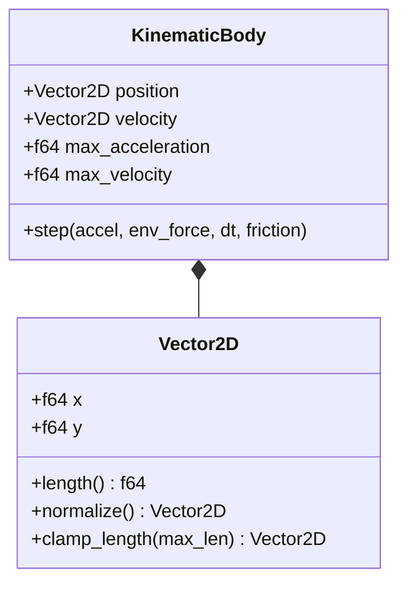

# DR-002: Векторная кинематика и физическая модель движения (Vector Physics & Motion)

## 1. Бизнес-контекст

**Проблема / Возможность:**  
Игровой процесс DatsMagic построен на реалистичном поведении ковров-самолетов в условиях инерции, сопротивления среды (песок/воздух) и воздействия внешних сил (вихрей). Необходим детерминированный, быстрый и физически корректный расчет траекторий точек на плоскости.

**Цель:**  
Реализовать расчет кинематики объектов на 2D-плоскости по схеме численного интегрирования Эйлера с учетом вязкого трения, жестких ограничений по предельной скорости и ускорению, а также суммирования внешних сил.

**Пользователи / Роли:**  
- **Физический решатель (Physics Solver)** — компонент ядра сервера, выполняющий векторные вычисления на каждом тике.
- **Предиктор траекторий (Клиентский AI/Бот)** — использует идентичные формулы для прогнозирования полета.

**Ключевые метрики:**  
- Детерминизм вычислений: отсутствие накопления погрешностей float-арифметики за пределами допустимого $\varepsilon = 10^{-6}$.
- Время шага симуляции физики: менее 1 мс на 1000 динамических точек.

---

## 2. Сценарии использования

### 2.1 Основной сценарий (Happy Path)

| № | Участник | Действие | Результат |
|---|---|---|---|
| 1 | Игровой цикл | Передает в физический решатель текущее состояние ковра $(\vec{P}, \vec{V})$ и команду $\vec{A}$ | Начинается расчет шага |
| 2 | Решатель | Проверяет норму $\|\vec{A}\| \le A_{max}$; при превышении масштабирует вектор | Ускорение ограничено до $A_{max}$ |
| 3 | Решатель | Получает вектор внешних сил $\vec{W}$ (от активных вихрей) | Сформирована суммарная внешняя сила |
| 4 | Решатель | Вычисляет новую скорость: $\vec{V}_{new} = (\vec{V}_{old} \cdot k_f) + (\vec{A} + \vec{W}) \cdot \Delta t$ | Скорость обновлена с учетом трения |
| 5 | Решатель | При $\|\vec{V}_{new}\| > V_{max}$ усекает модуль до $V_{max}$ | Скорость не превышает порог симуляции |
| 6 | Решатель | Вычисляет новые координаты: $\vec{P}_{new} = \vec{P}_{old} + \vec{V}_{new} \cdot \Delta t$ | Точка перемещена в пространстве |

### 2.2 Альтернативные сценарии

- **Сценарий A (нет новой команды на тик):** Повторно применяется последнее принятое эффективное ускорение. Отсутствие запроса не означает остановку; нулевой вектор должен быть передан явно.
- **Сценарий B (отсутствие внешних сил $\vec{W} = \vec{0}$ и явная команда $\vec{A} = \vec{0}$):** Происходит экспоненциальное затухание скорости за счет коэффициента трения $k_f = 0.98$.

### 2.3 Исключительные ситуации (Error Path)

| Условие | Реакция системы |
|---|---|
| Деление на ноль при нормализации нулевого вектора ускорения ($\|\vec{A}\| = 0$) | Пропуск операции нормализации, вектор остается $(0, 0)$ |
| Нечисловые значения параметров (`NaN`, `Infinity`) | Защитный сброс некорректного вектора в $(0, 0)$, логирование критического инцидента |

---

## 3. Функциональные требования

| ID | Требование | Приоритет | Примечание |
|---|---|---|---|
| FR-01 | Система должна представлять физическое пространство как 2D декартову плоскость ($X$ вправо, $Y$ вверх). | Must have | Базовый базис симулятора |
| FR-02 | Система должна поддерживать векторные операции над 2D-векторами: сложение, вычитание, скалярное умножение, длина, нормализация. | Must have | Ядро векторной математики |
| FR-03 | Система должна нормализовать вектор управления игрока до $A_{max}$, если $\|\vec{A}\| > A_{max}$. | Must have | Защита от читерства |
| FR-04 | Система должна уменьшать скорость ковра на коэффициент трения $k_f = 0.98$ на каждом тике перед добавлением импульса. | Must have | Модель сопротивления среды |
| FR-05 | Система должна ограничивать скорость ковра порогом $V_{max}$ с сохранением угла направления. | Must have | Физическое ограничение движения |
| FR-06 | Система должна обновлять координаты точки линейным шагом $\vec{P} + \vec{V} \cdot \Delta t$ ($\Delta t = 0.2$ с). | Must have | Схема Эйлера 1-го порядка |

---

## 4. Нефункциональные требования

| ID | Требование | Значение / Описание |
|---|---|---|
| NFR-01 | Вычислительная точность | Использование чисел с плавающей точкой 64-бит (`f64`) для физических расчетов |
| NFR-02 | Высокая производительность | Векторные операции должны быть `#[inline]` и свободны от динамических аллокаций памяти (`no heap allocations`) |
| NFR-03 | Чистота функций (Pure Functions) | Функция шага физики должна быть чистой функцией: $(\text{State}, \text{Forces}, \Delta t) \to \text{NewState}$ |

---

## 5. Бизнес-правила

1. **Правило приоритета оглушения:** Статус `stunned` имеет наивысший приоритет и полностью подавляет заявленный вектор $\vec{A}$.
2. **Правило сохранения вектора при клампинге:** При ограничении модуля скорости или ускорения ориентация вектора в пространстве остается неизменной.
3. **Правило непрерывности физического мира:** Координаты не квантуются в дискретную сетку, а сохраняются непрерывными числами с плавающей точкой.

---

## 6. Модель данных (логическая)

### Сущности

| Сущность | Описание | Ключевые атрибуты |
|---|---|---|
| `Vector2D` | Двумерный вектор на плоскости | `x: f64`, `y: f64` |
| `KinematicBody` | Физическое тело с кинематическими параметрами | `position: Vector2D`, `velocity: Vector2D`, `max_acceleration: f64`, `max_velocity: f64` |
| `EnvironmentForces` | Результирующий вектор сил окружения | `force: Vector2D` |

### Схема сущностей



---

## 7. API-контракты (со стороны бэкенда)

Физический модуль является внутренним компонентом сервера и предоставляет Rust-интерфейс (Trait):

```rust
pub trait PhysicsIntegrator {
    fn step(
        &self,
        body: &mut KinematicBody,
        command: Option<Vector2D>,
        env_forces: Vector2D,
        dt: f64,
        friction: f64,
        is_stunned: bool,
    );
}
```

---

## 8. Критерии приёмки (Acceptance Criteria)

- [ ] AC-01: При отсутствии сил и управления скорость уменьшается ровно на множитель $0.98$ за шаг $\Delta t$.
- [ ] AC-02: Вектор ускорения с длиной $> A_{max}$ пропорционально масштабируется до длины ровно $A_{max}$.
- [ ] AC-03: Скорость тела не может превысить $V_{max}$ ни при каких комбинациях управляющих и внешних сил.
- [ ] AC-04: При `is_stunned == true` любое значение команды управления приравнивается к $(0, 0)$.

---

## 9. Вопросы и допущения

**Допущения:**
1. Масса всех ковров принята единичной ($m = 1$), поэтому понятия силы и ускорения эквивалентны ($\vec{F} = \vec{A}$).
2. Используется схема численного интегрирования Эйлера 1-го порядка, строго согласно [`docs/mechanics.md`](file:///Users/d.byta/Documents/Code/dats/datsmagic/docs/mechanics.md).

---

## 10. Зависимости

- **Контекст вызова:** Игровой цикл ([`DR-001`](file:///Users/d.byta/Documents/Code/dats/datsmagic/docs/domain/DR-001-game-loop-and-state.md)).
- **Поставщик внешних сил:** Модуль взаимодействия сущностей ([`DR-003`](file:///Users/d.byta/Documents/Code/dats/datsmagic/docs/domain/DR-003-entity-interactions-and-collisions.md)).

---

## История изменений

| Версия | Дата | Автор | Изменение |
|---|---|---|---|
| 1.0 | 2026-09-30 | AI Agent | Выделение кинематики и физической модели в соответствии с SRP |
| 1.1 | 2026-10-02 | Codex | Отсутствие свежего пакета удерживает последнее принятое ускорение; остановка задается явным нулевым вектором. |
