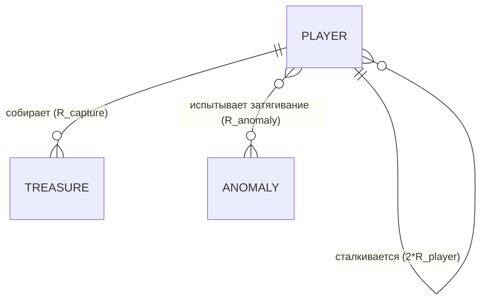

# DR-003: Взаимодействие игровых сущностей и обработка коллизий (Entity Interactions & Collisions)

## 1. Бизнес-контекст

**Проблема / Возможность:**  
Игровой мир DatsMagic наполнен динамическими объектами (ковры игроков и противников) и статическими/зональными объектами (сокровища, песчаные вихри-аномалии). Для обеспечения соревновательной механики сервер должен корректно и производительно вычислять взаимные влияния и пересечения этих объектов в 2D-пространстве.

**Цель:**  
Обеспечить высокопроизводительное обнаружение коллизий между игроками и сокровищами (для начисления очков), расчет зон влияния аномалий (векторы гравитационного затягивания и наложение эффекта оглушения `stunned`), а также детекцию столкновений между коврами игроков.

**Пользователи / Роли:**  
- **Диспетчер коллизий (Collision Manager)** — серверный модуль, проверяющий дистанции и пересечения объектов на каждом тике.
- **Игрок / Противник** — субъект, перемещающийся по карте, собирающий сокровища и попадающий под эффекты аномалий.

**Ключевые метрики:**  
- Производительность проверки: обработка до 10 000 проверок расстояния за такт менее чем за 1 мс.
- Точность захвата: 100% сокровищ в радиусе $R_{capture}$ засчитываются игроку без пропусков.

---

## 2. Сценарии использования

### 2.1 Основной сценарий: Захват сокровища (Happy Path)

| № | Участник | Действие | Результат |
|---|---|---|---|
| 1 | Игровой цикл | Передает обновленные координаты ковра $\vec{P}_{player}$ | Запускается фаза проверки коллизий |
| 2 | Диспетчер коллизий | Вычисляет евклидово расстояние до каждого сокровища: $d = \|\vec{P}_{player} - \vec{P}_{treasure}\|$ | Определяются сокровища с $d \le R_{capture}$ |
| 3 | Диспетчер коллизий | Начисляет игроку очки $S$ (ценность сокровища) | Счет игрока `score` увеличивается на $S$ |
| 4 | Диспетчер коллизий | Помечает сокровище как собранное и удаляет его со сцены | Сокровище пропадает из снапшота состояния мира |

### 2.2 Сценарий взаимодействия с аномалией (Вихрем)

| № | Участник | Действие | Результат |
|---|---|---|---|
| 1 | Диспетчер коллизий | Проверяет дистанцию до центра аномалии: $d = \|\vec{P}_{anomaly} - \vec{P}_{player}\|$ | Условие $d \le R_{anomaly}$ истинно |
| 2 | Диспетчер коллизий | Рассчитывает единичный вектор направления к центру вихря: $\vec{u} = \frac{\vec{P}_{anomaly} - \vec{P}_{player}}{d}$ | Направление притяжения сформировано |
| 3 | Диспетчер коллизий | Вычисляет силу притяжения: $\vec{w}_{anomaly} = \vec{u} \cdot F_{pull}$ | Вектор силы передается в физический решатель |
| 4 | Диспетчер коллизий | При критическом сближении с центром переводит игрока в статус `stunned` | Управление игрока блокируется сервером |

### 2.3 Взаимодействие ковров между собой (Столкновения игроков)

- При сближении центров двух ковров на расстояние $d \le 2 \cdot R_{player}$ фиксируется факт столкновения.
- Сервер применяет отталкивающий импульс или останавливает взаимопроникновение сущностей согласно радиусу коллизии.

---

## 3. Функциональные требования

| ID | Требование | Приоритет | Примечание |
|---|---|---|---|
| FR-01 | Система должна проверять условие захвата каждого сокровища: $\text{Distance}(\vec{P}_{player}, \vec{P}_{treasure}) \le R_{capture}$. | Must have | Начисление очков и удаление сокровища |
| FR-02 | Система должна начислять игроку целочисленный номинал сокровища `value` в момент захвата. | Must have | Модификация `player.score` |
| FR-03 | Система должна определять нахождение ковра в радиусе аномалии: $\text{Distance}(\vec{P}_{player}, \vec{P}_{anomaly}) \le R_{anomaly}$. | Must have | Формирование силы затягивания |
| FR-04 | Система должна вычислять вектор силы затягивания к центру аномалии с амплитудой $F_{pull}$. | Must have | Суммирование в $\vec{W} = \sum \vec{w}_i$ |
| FR-05 | Система должна переключать статус игрока в `stunned` при попадании в эпицентр аномалии и восстанавливать в `normal` по истечении эффекта. | Must have | Блокировка команд ускорения |
| FR-06 | Система должна учитывать геометрические габариты ковров при анализе взаимных столкновений. | Should have | Радиус коллизии $R_{player}$ |

---

## 4. Нефункциональные требования

| ID | Требование | Значение / Описание |
|---|---|---|
| NFR-01 | Оптимизация расстояния | Проверка условий коллизий через квадрат расстояния ($d^2 \le R^2$) без вызова тяжелой операции `sqrt`, где возможно |
| NFR-02 | Масштабируемость проверок | Архитектурная готовность к использованию пространственного разбиения (Spatial Grid / QuadTree) при росте числа объектов |
| NFR-03 | Идемпотентность захвата | Одно и то же сокровище не может быть захвачено двумя игроками дважды в одном тике (детерминированное разрешение конкуренции) |

---

## 5. Бизнес-правила

1. **Правило одновременного сбора:** Если два игрока достигают сокровища в один и тот же тик, награда делится поровну либо присуждается игроку с наименьшим евклидовым расстоянием.
2. **Правило суммирования вихрей:** Силы от нескольких аномалий, перекрывающих положение ковра, векторно складываются аддитивно: $\vec{W} = \sum \vec{w}_i$.
3. **Правило неуязвимости сокровищ:** Аномалии не влияют на сокровища; сокровища имеют статические координаты.

---

## 6. Модель данных (логическая)

### Сущности

| Сущность | Описание | Ключевые атрибуты |
|---|---|---|
| `Treasure` | Ценный объект на карте | `id: String`, `type: String`, `position: Vector2D`, `value: u32` |
| `Anomaly` | Песчаный вихрь с гравитационным полем | `id: String`, `position: Vector2D`, `radius: f64`, `force: f64` |
| `PlayerStatus` | Состояние контроля ковра | `Normal`, `Stunned { remaining_ticks: u32 }` |

### Диаграмма связей сущностей на карте

---

## 7. Критерии приёмки (Acceptance Criteria)

- [x] AC-01: Сокровище удаляется с карты, а счет игрока возрастает строго на `value`, когда расстояние $\le R_{capture}$.
- [x] AC-02: Сила затягивания вихря направлена строго к центру аномалии и имеет модуль $F_{pull}$.
- [x] AC-03: При выходе за пределы радиуса аномалии внешняя сила от нее обращается в ноль.
- [x] AC-04: При статусе `stunned` флаг оглушения корректно транслируется в состояние игрока для API.

---

## 8. Зависимости

- **Потребитель кинематики:** Физическая модель ([`DR-002`](file:///Users/d.byta/Documents/Code/dats/datsmagic/docs/domain/DR-002-vector-physics.md)).
- **Управление сущностями:** Игровой цикл ([`DR-001`](file:///Users/d.byta/Documents/Code/dats/datsmagic/docs/domain/DR-001-game-loop-and-state.md)).
- **Динамические аномалии и гибель:** Модель подвижных вихрей и смертоносных ядер ([`DR-005`](file:///Users/d.byta/Documents/Code/dats/datsmagic/docs/domain/DR-005-anomalies.md)).

---

## История изменений

| Версия | Дата | Автор | Изменение |
|---|---|---|---|
| 1.0 | 2026-09-30 | AI Agent | Выделение логики коллизий и взаимодействий объектов по SRP |
| 1.1 | 2026-09-30 | AI Agent | Подтверждение реализации критериев приёмки AC-01..AC-04 в FE-003 |
| 1.2 | 2026-09-30 | AI Agent | Связывание с DR-005 (делегирование динамических аномалий и фатальных ядер) |

