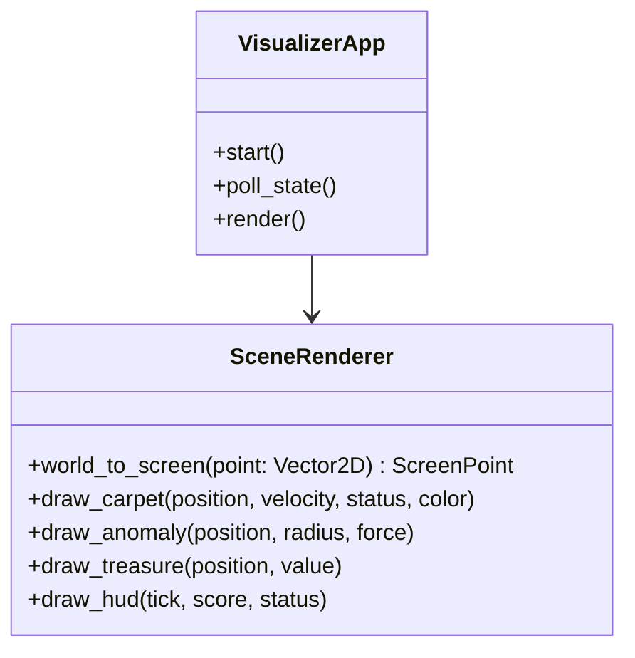

# DR-004: Мониторинг и визуализация игрового окружения (Simulation Visualization & Telemetry)

## 1. Бизнес-контекст

**Проблема / Возможность:**  
Поведение алгоритмов управления коврами-самолетами, динамика векторов сил и сложные траектории вблизи вихрей требуют наглядного графического представления для быстрой отладки, визуального анализа тактик и контроля хода симуляции.

**Цель:**  
Создать автономный графический клиент на Python, который опрашивает API игрового сервера и в реальном времени отображает 2D-карту пустыни, координаты и векторы скорости объектов, радиусы аномалий, сокровища и статистику матча.

**Пользователи / Роли:**  
- **Оператор / Разработчик** — визуально контролирует симуляцию, наблюдает за поведением ботов и физикой ковров.
- **Судья матча / Зритель** — отслеживает счет команд, статус оглушения и оставшееся время.

**Ключевые метрики:**  
- Частота обновления экрана: не менее 30 кадров в секунду (FPS).
- Задержка отрисовки нового тика (latency): не более 50 мс с момента завершения тика на сервере.

---

## 2. Сценарии использования

### 2.1 Основной сценарий (Happy Path)

| № | Участник | Действие | Результат |
|---|---|---|---|
| 1 | Оператор | Запускает клиент визуализации с указанием URL сервера и токена | Инициализируется графическое окно |
| 2 | Клиент визуализации | Отправляет запрос `GET /api/game/state` | Сервер возвращает текущий JSON-снапшот |
| 3 | Клиент визуализации | Выполняет проекцию декартовых координат ($Y$ вверх) в экранные координаты окна ($Y$ вниз) | Координаты адаптированы для отрисовки |
| 4 | Клиент визуализации | Отрисовывает аномалии (круги), сокровища (иконки/точки), ковры игроков и противников | Сформирован графический кадр |
| 5 | Клиент визуализации | Рисует векторы текущей скорости $\vec{V}$ в виде направленных стрелок от центра каждого ковра | Направление движения наглядно отображено |
| 6 | Клиент визуализации | Отображает информационную панель (HUD): номер тика, счет, статус игрока | Статистика доступна оператору |

### 2.2 Альтернативные сценарии

- **Сценарий A (Интерполяция между тиками):** При интервале между тиками сервера в 200 мс клиент выполняет плавную интерполяцию позиций объектов между полученными тиками для обеспечения плавной картинки при 60 FPS.
- **Сценарий B (Потеря связи с сервером):** При временной недоступности сервера клиент отображает плашку "Connecting to server..." и повторяет попытки подключения без аварийного завершения процесса.

---

## 3. Функциональные требования

| ID | Требование | Приоритет | Примечание |
|---|---|---|---|
| FR-01 | Клиент должен запрашивать состояние мира через HTTP эндпоинт `GET /api/game/state` с заданной периодичностью. | Must have | Синхронизация с сервером |
| FR-02 | Клиент должен корректно отображать декартову систему координат: $X$ растет вправо, $Y$ растет вверх. | Must have | Корректная трансформация осей |
| FR-03 | Клиент должен визуализировать ковер игрока и ковры противников различными цветовыми маркерами. | Must have | Идентификация команд |
| FR-04 | Клиент должен отображать векторы текущей скорости $\vec{V}$ в виде стрелок, пропорциональных величине скорости. | Must have | Анализ кинематики |
| FR-05 | Клиент должен отображать зоны аномалий в виде полупрозрачных окружностей радиуса $R_{anomaly}$. | Must have | Наглядность опасных зон |
| FR-06 | Клиент должен отображать сокровища с указанием их ценности $S$. | Should have | Приоритезация целей |
| FR-07 | Клиент должен выводить HUD со счетом, текущим тиком и статусом игрока (`normal` / `stunned`). | Must have | Информативность |

---

## 4. Нефункциональные требования

| ID | Требование | Значение / Описание |
|---|---|---|
| NFR-01 | Технологический стек | Язык **Python 3.10+**, библиотека отрисовки **Pygame** или **Arcade** |
| NFR-02 | Независимость | Сбой или остановка визуализатора не должны влиять на работу сервера симуляции |
| NFR-03 | Низкое потребление CPU | Использование эффективного рендеринга без холостых циклов ожидания (event loop) |

---

## 5. Бизнес-правила

1. **Правило пассивного наблюдателя:** Клиент визуализации работает строго в режиме чтения (Read-Only) и не отправляет управляющие команды на сервер.
2. **Правило масштабируемости камеры:** Окно должно поддерживать центрирование на ковре игрока или автомасштабирование по границам всех видимых объектов.

---

## 6. Модель данных (логическая)

---

## 7. Критерии приёмки (Acceptance Criteria)

- [x] AC-01: Окно визуализатора открывается и стабильно отображает сцену с частотой не менее 30 FPS.
- [x] AC-02: Позиции всех сущностей из ответа `GET /api/game/state` соответствуют их координатам на холсте.
- [x] AC-03: Вектор скорости отображается направленным отрезком правильной длины.
- [x] AC-04: При оглушении ковра на экране отображается визуальный индикатор статуса `stunned`.

---

## 8. Зависимости

- **Источник данных:** REST API игрового сервера ([`DR-001`](file:///Users/d.byta/Documents/Code/dats/datsmagic/docs/domain/DR-001-game-loop-and-state.md)).

---

## История изменений

| Версия | Дата | Автор | Изменение |
|---|---|---|---|
| 1.0 | 2026-09-30 | AI Agent | Создание Domain Record для клиента визуализации согласно SRP |
| 1.1 | 2026-09-30 | AI Agent | Подтверждение выполнения критериев приёмки AC-01..AC-04 в FE-005 |
| 1.2 | 2026-09-30 | AI Agent | Расширение для визуализации флота 5 ковров, анимации взрывов и градации монет (FE-012) |
