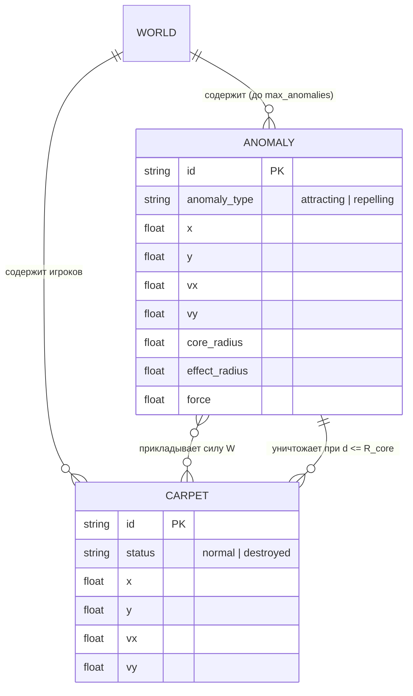
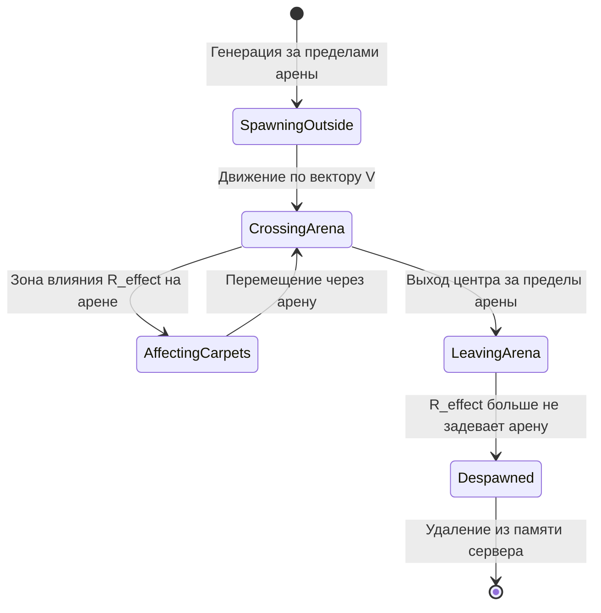

# DR-005: Динамические аномалии, силовые поля и уничтожение ковров (Dynamic Moving Anomalies & Carpet Destruction)

> Доменная спецификация подсистемы подвижных песчаных вихрей-аномалий, дуальных силовых полей (притяжение и отталкивание), их жизненного цикла (рождение, траектория, смерть) и смертоносных ядер, уничтожающих ковры.

---

## 1. Бизнес-контекст

**Проблема / Возможность:**  
Аномалии — подвижные природные стихии пустыни: блуждающие песчаные вихри двух типов (притягивающие и отталкивающие), которые движутся сквозь карту, затягивают или расталкивают ковры игроков и представляют смертельную угрозу при контакте с центральным ядром. Воздействие меняет траекторию, но не блокирует управление.

**Цель:**  
Формализовать правила генерации, движения, силового воздействия и деспавна динамических аномалий, а также механику фатального уничтожения ковров при соприкосновении с ядром аномалии.

**Пользователи / Роли:**  
- **Генератор окружения (Anomaly Spawner)** — серверный модуль, контролирующий численность, спавн за пределами арены, расчет сквозных траекторий и деспавн аномалий.
- **Физический движок (Physics & Collisions Solver)** — модуль, вычисляющий радиальные векторы сил $\vec{W}$ для каждого ковра и регистрирующий касания с ядрами аномалий.
- **Игрок / Бот** — агент, который должен учитывать вектор движения вихря, динамику притяжения/отталкивания и избегать смертельного контакта с ядром.
- **Клиент визуализации** — графический интерфейс, отображающий движение аномалий, их ядра, радиусы влияния, векторную природу поля и факт уничтожения ковра.

**Ключевые метрики:**  
- **100% гарантия пересечения арены**: каждая заспавненная аномалия пересекает своей зоной влияния игровое поле.
- **Надежность детекции разрушения**: ни один ковер, коснувшийся ядра ($d \le R_{core} + R_{carpet}$), не избегает уничтожения.
- **Соблюдение лимита популяции**: число одновременных аномалий строго ограничено константой $N_{max}$.

---

## 2. Сценарии использования

### 2.1 Основной сценарий: Полный жизненный цикл динамической аномалии (Happy Path)

| № | Участник | Действие | Результат |
|---|---|---|---|
| 1 | Spawner | Фиксирует, что текущее число аномалий $N < N_{max}$ | Принимается решение о генерации новой аномалии |
| 2 | Spawner | Генерирует параметры: тип (`attracting` или `repelling`), радиус ядра $R_{core}$, радиус влияния $R_{effect}$, силу $F$, скорость $\|\vec{V}\|$ | Параметры выбраны случайным образом в заданных диапазонах |
| 3 | Spawner | Выбирает точку рождения $\vec{P}_{spawn}$ за границами арены и целевую траекторию $\vec{V}$ с гарантией пересечения мира | Аномалия появляется в буферной зоне за границей карты |
| 4 | Physics Engine | На каждом тике $\Delta t$ смещает аномалию: $\vec{P}_{new} = \vec{P} + \vec{V} \cdot \Delta t$ | Аномалия плавно перемещается через арену |
| 5 | Physics Engine | Накладывает радиальные силы $\vec{W}$ на ковры, находящиеся в зоне действия $R_{core} < d \le R_{effect}$ | Траектории ковров искривляются под действием поля |
| 6 | Spawner | Фиксирует выход зоны влияния аномалии за пределы арены в точку смерти $\vec{P}_{despawn}$ | Аномалия деспавнится и удаляется из памяти сервера |

### 2.2 Взаимодействие ковра с аномалией

#### 2.2.1 Притягивающая аномалия (Attracting Hazard)
1. Ковер входит в область $d \le R_{effect}$.
2. Сервер рассчитывает силу притяжения к ядру:
   $$\vec{W}_{pull} = \frac{\vec{P}_{core} - \vec{P}_{carpet}}{\|\vec{P}_{core} - \vec{P}_{carpet}\|} \cdot F_{influence}$$
3. Ковер затягивается к ядру. Игрок может противодействовать ускорением $\vec{A}$ или вылететь из зоны влияния благодаря набранной инерции.

#### 2.2.2 Отталкивающая аномалия (Repelling Hazard)
1. Ковер входит в область $d \le R_{effect}$.
2. Сервер рассчитывает силу отталкивания от ядра:
   $$\vec{W}_{push} = \frac{\vec{P}_{carpet} - \vec{P}_{core}}{\|\vec{P}_{carpet} - \vec{P}_{core}\|} \cdot F_{influence}$$
3. Ковер выталкивается наружу от ядра, получая дополнительное радиальное ускорение от центра вихря.

#### 2.2.3 Фатальное соприкосновение с ядром (Lethal Core Collision)
1. Расстояние между центром ковра и центром аномалии достигает критического порога:
   $$d \le R_{core} + R_{carpet}$$
2. Ковер мгновенно помечается как **уничтоженный** (`status = "destroyed"`).
3. Сущность ковра исключается из симуляции, перестает участвовать в физических расчетах и удаляется из визуализации.

### 2.3 Пересечение нескольких аномалий (Ghosting & Superposition)

- Аномалии могут свободно проходить сквозь друг друга без изменения своих скоростей, импульсов и траекторий (отсутствие взаимоколлизий аномалий).
- Если ковер оказывается в зоне действия одновременно нескольких аномалий, результирующая сила вычисляется аддитивной векторной суперпозицией:
  $$\vec{W}_{total} = \sum_{i} \vec{W}_{i}$$

### 2.4 Исключительные ситуации (Error Path)

| Условие | Реакция системы |
|---|---|
| Сгенерированная траектория аномалии не пересекает арену | Траектория отбраковывается и перегенерируется до удовлетворения геометрического критерия пересечения |
| Деление на ноль при совпадении координат ковра и центра аномалии ($d = 0$) | При $d \le R_{core}$ немедленно регистрируется уничтожение ковра; деление на ноль исключается защитным эпсилоном $\epsilon = 10^{-6}$ |
| Попытка спавна при $N \ge N_{max}$ | Генерация блокируется до освобождения слота после деспавна одной из существующих аномалий |

---

## 3. Функциональные требования

| ID | Требование | Приоритет | Примечание |
|---|---|---|---|
| FR-01 | Система должна поддерживать двухкомпонентную геометрию аномалии: круглое смертоносное ядро радиуса $R_{core}$ и круговую внешнюю область влияния радиуса $R_{effect}$ ($R_{core} < R_{effect}$). | Must have | Концентрические круги |
| FR-02 | Система должна поддерживать два взаимоисключающих типа воздействия аномалии: `attracting` (притягивающая) и `repelling` (отталкивающая). | Must have | Знак радиального вектора силы |
| FR-03 | Каждая аномалия должна обладать собственной силой воздействия $F_{influence}$, генерируемой при рождении из диапазона $[F_{min}, F_{max}]$. | Must have | Величина ускорения среды |
| FR-04 | При пересечении ковра с ядром ($d \le R_{core} + R_{carpet}$) система обязана переводить ковер в статус `destroyed` и исключать его из симуляции. | Must have | Механика перманентной гибели |
| FR-05 | Система должна обеспечивать автономное непрерывное движение аномалии с постоянным вектором скорости $\vec{V}_{anomaly}$. | Must have | $\vec{P}_{new} = \vec{P}_{old} + \vec{V} \cdot \Delta t$ |
| FR-06 | Точка рождения аномалии $\vec{P}_{spawn}$ должна располагаться за пределами игровой арены на расстоянии не более $\delta_{spawn\_max}$. | Must have | Спавн в буферной зоне |
| FR-07 | Траектория аномалии обязана гарантировать пересечение зоны влияния $R_{effect}$ с прямоугольником игровой арены. | Must have | Проверка пересечения луча/отрезка и AABB |
| FR-08 | При полном выходе области влияния аномалии за пределы арены система обязана деспавнить аномалию и удалять ее из списка активных объектов. | Must have | Освобождение ресурсов и слота |
| FR-09 | Аномалии должны быть прозрачны друг для друга (Ghosting) и беспрепятственно пересекаться. | Must have | Отсутствие взаимного отталкивания |
| FR-10 | Силы воздействия нескольких аномалий на один ковер должны векторно складываться: $\vec{W} = \sum \vec{W}_i$. | Must have | Принцип суперпозиции сил |
| FR-11 | Число одновременно существующих аномалий не должно превышать сконфигурированный лимит $N_{max}$. | Must have | Баланс плотности угроз |

---

## 4. Нефункциональные требования

| ID | Требование | Значение / Описание |
|---|---|---|
| NFR-01 | Производительность расчета коллизий | Определение попадания в ядро и расчет сил для 50 объектов — не более $0.2\text{ мс}$ на такт симуляции (через $d^2 \le R^2$). |
| NFR-02 | Численная устойчивость | Полное исключение `NaN` и `Infinity` при вычислении направляющих векторов при $d \to 0$. |
| NFR-03 | Детерминизм генератора | Возможность инициализации генератора случайных чисел фиксированным сидом (`seed`) для повторяемости тестов. |
| NFR-04 | Сетевая синхронизация | Полная передача параметров аномалий (тип, координаты, ядро, радиус, вектор скорости) клиентам через REST API. |

---

## 5. Бизнес-правила

1. **Правило иерархии радиусов:**  
   Радиус ядра $R_{core}$ строго меньше радиуса зоны влияния $R_{effect}$ ($R_{core} < R_{effect}$). Диапазоны задаются конфигурацией: $R_{core} \in [R_{core\_min}, R_{core\_max}]$, $R_{effect} \in [R_{effect\_min}, R_{effect\_max}]$.
2. **Правило фатальности ядра (Instant Elimination):**  
   Касание ядра является необратимым фатальным событием. Ковер игрока немедленно прекращает существование, его управление аннулируется, он исчезает с арены и в API помечается статусом `destroyed`.
3. **Правило направления сил воздействия:**
   - Для `attracting`: $\vec{w} = \dfrac{\vec{P}_{core} - \vec{P}_{carpet}}{\|\vec{P}_{core} - \vec{P}_{carpet}\|} \cdot F_{influence}$.
   - Для `repelling`: $\vec{w} = \dfrac{\vec{P}_{carpet} - \vec{P}_{core}}{\|\vec{P}_{carpet} - \vec{P}_{core}\|} \cdot F_{influence}$.
4. **Правило траекторного пересечения арены:**  
   Вектор скорости $\vec{V}$ и точка старта $\vec{P}_{spawn}$ выбираются так, чтобы геометрический отрезок движения от $\vec{P}_{spawn}$ до $\vec{P}_{despawn}$ пересекал границы игрового поля, и круг радиуса $R_{effect}$ имел непустое пересечение с ареной.
5. **Диапазоны параметров:** по умолчанию скорость аномалии выбирается из $[30, 160]$ единиц/с, радиус ядра из $[20, 30]$, радиус влияния из $[300, 2000]$. Одновременно действует не более 50 аномалий. Конфигурация обязана сохранять $R_{core} < R_{effect}$.
6. **Правило деспавна (Terminal Boundary Condition):**
   Аномалия подлежит удалению, когда расстояние от ее центра до любого края арены превышает радиус ее области воздействия $R_{effect}$, и вектор скорости направлен от арены наружу.
7. **Правило взаимопроникновения (Ghosting Rule):**
   Аномалии игнорируют существование других аномалий. Никаких физических сил между аномалиями не возникает.
8. **Правило аддитивной суперпозиции (Superposition Rule):**
   Воздействие нескольких аномалий суммируется векторно без нелинейных интерференций.
9. **Обратная зависимость силы от размера:** размером считается радиус влияния $R_{effect}$. В обычном случае сила линейно убывает от $F_{max}$ у минимального радиуса к $F_{min}$ у максимального радиуса:
   $$F_{base}=F_{max}-(F_{max}-F_{min})\cdot\frac{R_{effect}-R_{effect\_min}}{R_{effect\_max}-R_{effect\_min}}.$$
   Для обычных аномалий $F_{min}=4$, $F_{max}=22$. С вероятностью 10% выбирается отдельная сила-выброс из $[55,100]$, независимая от радиуса: такие аномалии намеренно сильнее максимального ускорения ковра ($A_{max}=40$), поэтому их нельзя гарантированно компенсировать после входа в поле; от них следует уклоняться заранее. При вырожденном диапазоне радиусов используется $F_{base}=F_{max}$.

---

## 6. Модель данных (логическая)

### Сущности

| Сущность | Описание | Ключевые атрибуты |
|---|---|---|
| `Anomaly` | Динамическая пространственная аномалия | `id`, `anomaly_type`, `position`, `velocity`, `core_radius`, `effect_radius`, `force` |
| `AnomalyType` | Перечисление типа воздействия | `Attracting` (притяжение), `Repelling` (отталкивание) |
| `Carpet` | Управляемый ковер игрока | `id`, `position`, `velocity`, `status: Normal \| Destroyed` |

### Связи сущностей



### Жизненный цикл аномалии



---

## 7. API-контракты (со стороны бэкенда)

Спецификация схемы данных аномалии в эндпоинте `GET /api/game/state`:

```json
{
  "anomalies": [
    {
      "id": "a_dyn_101",
      "type": "attracting",
      "position": { "x": 510.4, "y": 320.1 },
      "velocity": { "x": 4.5, "y": -2.0 },
      "core_radius": 15.0,
      "radius": 85.0,
      "force": 4.2
    },
    {
      "id": "a_dyn_102",
      "type": "repelling",
      "position": { "x": 120.0, "y": 890.0 },
      "velocity": { "x": -3.0, "y": 1.2 },
      "core_radius": 10.0,
      "radius": 60.0,
      "force": 5.5
    }
  ],
  "player": {
    "id": "team_1",
    "status": "destroyed",
    "score": 450,
    "position": { "x": 0.0, "y": 0.0 },
    "velocity": { "x": 0.0, "y": 0.0 }
  }
}
```

---

## 8. Критерии приёмки (Acceptance Criteria)

- [ ] **AC-01**: Аномалия имеет четкое разделение на смертоносное ядро $R_{core}$ и область действия $R_{effect}$ ($R_{core} < R_{effect}$).
- [ ] **AC-02**: При попадании ковра в зону $R_{core} < d \le R_{effect}$ притягивающей аномалии к нему прикладывается сила $\vec{W}$, направленная к ядру.
- [ ] **AC-03**: При попадании ковра в зону $R_{core} < d \le R_{effect}$ отталкивающей аномалии к нему прикладывается сила $\vec{W}$, направленная от ядра наружу.
- [ ] **AC-04**: При дистанции $d \le R_{core} + R_{carpet}$ ковер немедленно уничтожается (`status = "destroyed"`), исключается из симуляции и визуализатора.
- [ ] **AC-05**: Аномалия рождается за пределами арены на расстоянии $\le \delta_{spawn\_max}$ с вектором скорости, гарантирующим пересечение зоны действия с ареной.
- [ ] **AC-06**: Аномалия автоматически деспавнится, как только полностью выходит за пределы арены и больше не касается ее зоной действия.
- [ ] **AC-07**: Аномалии проходят сквозь друг друга без коллизий, их силы суммируются векторно.
- [ ] **AC-08**: Число одновременных аномалий в мире не превышает лимита `max_anomalies`.

---

## 9. Вопросы и допущения

**Допущения:**
1. Движение аномалий считается прямолинейным и равномерным ($\vec{V}_{anomaly} = \text{const}$).
2. Масса ковра условно равна 1, поэтому ускорение от силы аномалии $\vec{A}_{env} = \vec{W}$.
3. Радиус коллизии ковра с ядром $R_{carpet}$ определяется конфигурацией сервера (по умолчанию $R_{carpet} = 0$ или $5.0$).

---

## 10. Зависимости

- **Внутренние модули:**
  - `docs/domain/DR-001-game-loop-and-state.md` — включение фазы движения аномалий и детекции гибели в единый такт.
  - `docs/domain/DR-002-vector-physics.md` — расчет сил притяжения/отталкивания и передача в векторный интегратор.
  - `docs/domain/DR-003-entity-interactions-and-collisions.md` — делегирование логики аномалий в DR-005.
  - `visualizer_2/docs/features/FE-002-world-rendering.md` — визуализация типов аномалий, областей влияния и ядер.

---

## История изменений

| Версия | Дата | Автор | Изменение |
|---|---|---|---|
| 1.0 | 2026-09-30 | Lead Architect & AI Agent | Формализация предметной области динамических аномалий, дуальных сил и гибели ковров по шаблону DOMAIN_RECORD_TEMPLATE |
| 1.1 | 2026-10-02 | Codex | Зафиксировано, что силовое поле не блокирует управление; опасность аномалии задается отклонением курса и летальным ядром. |
| 1.2 | 2026-10-02 | Codex | Квота увеличена до 50; определены обычный диапазон силы 4–22 и редкие некомпенсируемые выбросы 55–100 (10%). |
