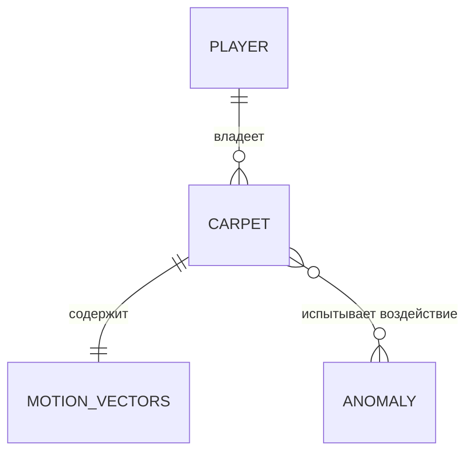
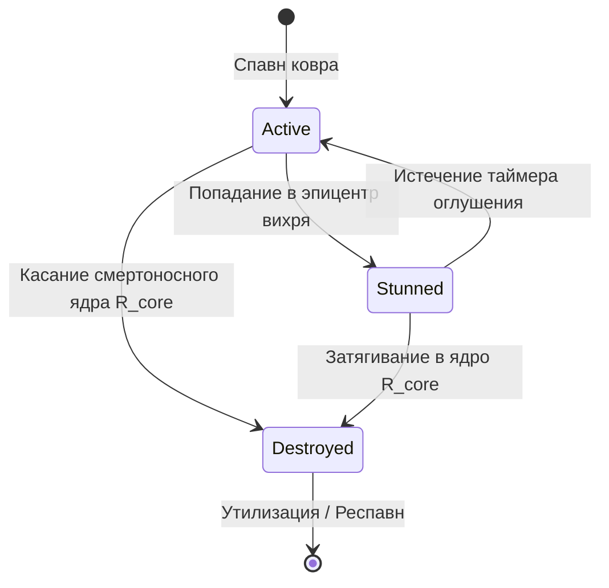

# DR-006: Физическая модель и динамическое поведение ковра-самолета (Carpet Mechanics)

## 1. Бизнес-контекст

**Проблема / Возможность:**  
Ковер-самолет является фундаментальным игровым аватаром участника соревнований DatsMagic. Чтобы игра обладала соревновательной глубиной и динамикой, управление ковром должно сочетать прямое управляющее воздействие игрока и нелинейное влияние динамического окружения (подвижные вихри и аномалии пустыни).

**Цель:**  
Формализовать кинематическую и силовую модель ковра-самолета как нематериальной материальной точки с тремя векторами состояния, описать алгоритм динамического изменения траектории при входе в поля влияния аномалий и зафиксировать условия гибели при контакте со смертоносным ядром.

**Пользователи / Роли:**  
- **Игровой агент (Бот игрока)** — формирует вектор управляющего ускорения ковра на каждый такт симуляции.
- **Физический движок (Physics Engine)** — производит интегрирование векторов, расчет трения среды и суперпозиции внешних сил.
- **Пространственный менеджер (Spatial Engine)** — отслеживает дистанции до аномалий и ядер поражения.
- **Визуализатор (2D Client)** — отображает нематериальную точку ковра, вектор скорости и ореол взаимодействия.

**Ключевые метрики:**  
- Предсказуемость и физическая непрерывность траектории: отсутствие скачков положения за исключением респавна.
- Динамический отклик: изменение вектора скорости при попадании в поле аномалии согласно законам суперпозиции сил.

---

## 2. Сценарии использования

### 2.1 Основной сценарий (Happy Path)

| № | Участник | Действие | Результат |
|---|---|---|---|
| 1 | Игрок | Передает вектор желаемого ускорения $\vec{A}$ через API | Сервер валидирует ограничение $\|\vec{A}\| \le A_{max}$ |
| 2 | Физический движок | Считывает текущее положение ковра $\vec{P}$ и его скорость $\vec{V}$ | Определяются начальные кинематические параметры |
| 3 | Движок аномалий | Вычисляет результирующую силу $\vec{W}$ от всех перекрывающих аномалий | Учитываются тип аномалии, сила $F$, скорость аномалии $\vec{V}_{a}$ |
| 4 | Физический движок | Выполняет интегрирование Эйлера: $\vec{V}_{new} = (\vec{V} \cdot k_f) + (\vec{A} + \vec{W}) \cdot \Delta t$ | Получен новый вектор скорости с учетом трения и внешних сил |
| 5 | Физический движок | Ограничивает скорость $\|\vec{V}_{new}\| \le V_{max}$ и обновляет позицию: $\vec{P}_{new} = \vec{P} + \vec{V}_{new} \cdot \Delta t$ | Ковер плавно перемещается по обновленной траектории |

### 2.2 Альтернативные сценарии

- **Сценарий A (Ковер движется в спокойной зоне без аномалий):** Внешняя сила $\vec{W} = (0, 0)$. Траектория определяется исключительно вектором управления игрока $\vec{A}$ и затуханием по инерции $k_f$.
- **Сценарий B (Игрок не передал ускорение $\vec{A} = (0, 0)$ в зоне аномалии):** Ковер подхватывается ветровым потоком вихря: притягивающая аномалия затягивает его по спирали к своему подвижному центру, отталкивающая — выбрасывает на периферию.

### 2.3 Исключительные ситуации (Error Path)

| Условие | Реакция системы |
|---|---|
| Ковер касается границы смертоносного ядра аномалии ($\text{dist} \le R_{core} + R_{player}$) | Ковер мгновенно уничтожается (`status = "destroyed"`), исключается из движения |
| Игрок находится в статусе оглушения (`stunned`) в эпицентре вихря | Управляющее ускорение принудительно обнуляется $\vec{A} = (0, 0)$, ковер не слушается руля |
| Заявленное ускорение превышает допустимый лимит $\|\vec{A}\| > A_{max}$ | Вектор принудительно нормализуется до длины $A_{max}$ с сохранением угла |

---

## 3. Функциональные требования

| ID | Требование | Приоритет | Примечание |
|---|---|---|---|
| FR-01 | Состояние ковра должно описываться ровно тремя ключевыми векторами: радиус-вектором положения $\vec{P}$, вектором скорости $\vec{V}$ и вектором управляющего ускорения $\vec{A}$. | Must have | Пользователь управляет только $\vec{A}$; $\vec{V}$ и $\vec{P}$ вычисляются сервером |
| FR-02 | Модуль управляющего ускорения должен быть ограничен сервером величиной $A_{max}$. | Must have | Константа конфигурации сервера (по умолчанию $5.0$) |
| FR-03 | Модуль скорости ковра должен быть ограничен сервером величиной $V_{max}$. | Must have | Константа конфигурации сервера (по умолчанию $20.0$) |
| FR-04 | При нахождении ковра в зоне действия аномалии ($d \le R_{effect}$) на ковер должна воздействовать внешняя сила $\vec{W}$, вектор которой зависит от типа вихря (`attracting` или `repelling`), силы $F$ и расстояния до центра аномалии. | Must have | Закон обратных квадратов или убывания силы по мере удаления от эпицентра |
| FR-05 | Внешняя сила аномалии должна динамически накладываться (суперпозиция) на управляющее ускорение ковра. | Must have | $\vec{A}_{eff} = \vec{A} + \vec{W}$ |
| FR-06 | Ковер в пространстве симулятора является нематериальной материальной точкой ($R = 0$) с радиусом сбора $R_{capture}$ и физическим радиусом безопасности $R_{player}$. | Must have | Все сущности рассматриваются как окружности |
| FR-07 | При сокращении расстояния между центром ковра и центром динамической аномалии до величины $d \le R_{core} + R_{player}$ ковер мгновенно уничтожается. | Must have | Статус переходит в `destroyed` |

---

## 4. Нефункциональные требования

| ID | Требование | Значение / Описание |
|---|---|---|
| NFR-01 | Детерминизм вычислений | Одинаковые векторы $\vec{A}$ и позиции аномалий обязаны давать строго одинаковую траекторию |
| NFR-02 | Защита от деления на ноль | При совпадении координат центра ковра и центра аномалии ($d \to 0$) внешняя сила обнуляется во избежание NaN |
| NFR-03 | Вычислительная сложность | Интегрирование одного ковра — $O(K)$, где $K$ — число активных аномалий (не более 10) |

---

## 5. Бизнес-правила

1. **Правило трех векторов:** Ковер обладает тремя кинематическими векторами:
   - $\vec{P} = (x, y)$ — абсолютные координаты в декартовой плоскости мира.
   - $\vec{V} = (v_x, v_y)$ — текущая скорость поступательного движения.
   - $\vec{A} = (a_x, a_y)$ — вектор ускорения тяги, задаваемый управляющей программой игрока.
2. **Правило динамического сноса:** Попадание в зону действия аномалии непрерывно искривляет вектор скорости ковра. Траектория ковра складывается из собственной инерции ($\vec{V} \cdot k_f$), управляющей тяги игрока ($\vec{A}$) и суммарного гравитационного/ветрового воздействия аномалий ($\vec{W}$).
3. **Правило смертоносного ядра:** Касание нематериальной точкой ковра защитной зоны ядра аномалии радиусом $R_{core} + R_{player}$ влечет мгновенную аннигиляцию ковра.

---

## 6. Модель данных (логическая)

### Сущности

| Сущность | Описание | Ключевые атрибуты |
|---|---|---|
| `CarpetEntity` | Нематериальная точка ковра-самолета | `id`, `owner_player_id`, `position (x, y)`, `velocity (vx, vy)`, `acceleration (ax, ay)`, `status`, `radius` |
| `MotionVectors` | Триплет векторов состояния ковра | `position: Vec2`, `velocity: Vec2`, `acceleration: Vec2` |

### Связи

### Статусная модель (жизненный цикл ковра)

---

## 7. API-контракты (со стороны бэкенда)

| Метод | Путь | Назначение | Параметры |
|---|---|---|---|
| POST | `/api/carpet/command` | Передать управляющий вектор ускорения $\vec{A}$ | `{"acceleration": {"x": 1.5, "y": -2.0}}` |
| GET | `/api/game/state` | Получить векторы позиции $\vec{P}$ и скорости $\vec{V}$ ковра | Заголовок `X-Auth-Token` |

---

## 8. Критерии приёмки (Acceptance Criteria)

- [ ] AC-01: Модель ковра содержит ровно три вектора: $\vec{P}$, $\vec{V}$ и $\vec{A}$.
- [ ] AC-02: Игрок имеет доступ на изменение только вектора $\vec{A}$; значения вектора нормализуются при превышении $A_{max}$.
- [ ] AC-03: Траектория движения ковра при пролете рядом с аномалией искривляется в реальном времени под действием $\vec{W}$.
- [ ] AC-04: При соприкосновении с ядром аномалии ($d \le R_{core} + R_{player}$) ковер переходит в статус `destroyed`.

---

## 9. Вопросы и допущения

- **Допущение:** Ковер не имеет массы как отдельной скалярной переменной (или масса принята равной $m = 1.0$), поэтому сила и ускорение численно эквивалентны ($\vec{A} = \vec{F} / m = \vec{F}$).
- **Допущение:** Трение среды $k_f = 0.98$ применяется к скорости на каждом шаге времени $\Delta t$.
