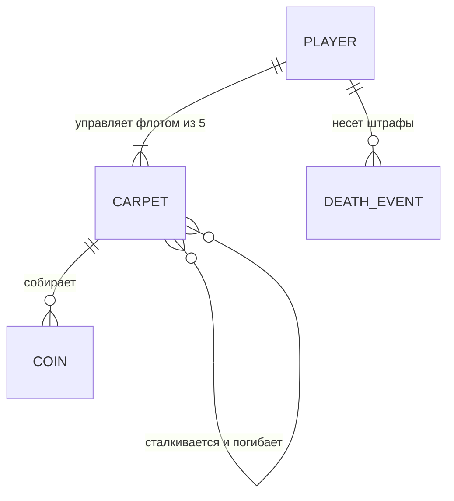
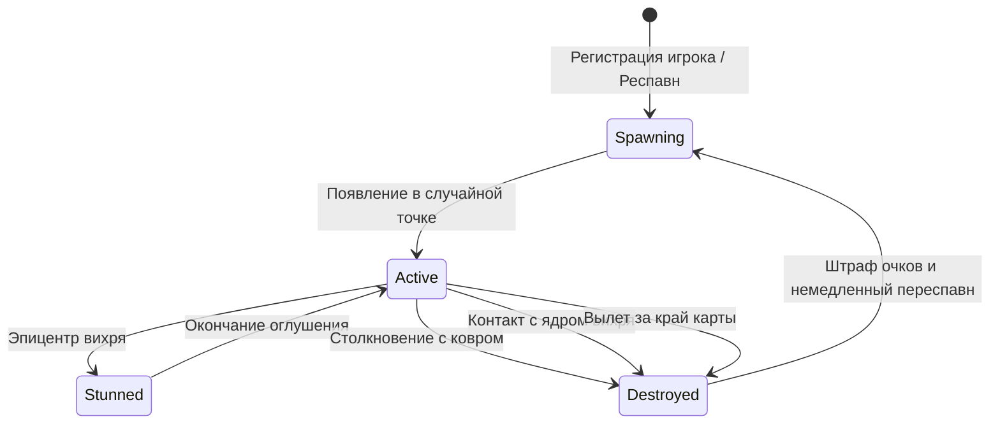

# DR-007: Игрок, управление флотом ковров и соревновательные механики (Player & Fleet Dynamics)

## 1. Бизнес-контекст

**Проблема / Возможность:**  
Управление единичным ковром ограничивает тактическую глубину матча и делает соревнование примитивным. Переход к концепции управления флотом из нескольких ковров создает пространство для многоуровневых командных стратегий (охота за сокровищами, перехват соперников, тактический размен ковров). При этом необходимы жесткие соревновательные риски: наказание за столкновения, вылет за пределы арены и попадание в смертоносные зоны.

**Цель:**  
Закрепить правила владения игроком флотом из 5 одновременных ковров, формализовать механику взаимного уничтожения ковров при столкновениях, гибель при вылете за границы арены, штрафную систему списания очков при гибели ковра и непрерывный респавн ковров для поддержания квоты флота.

**Пользователи / Роли:**  
- **Игровой агент (Бот команды)** — отправляет векторные команды для каждого из своих 5 ковров, стремится максимизировать суммарный `score`.
- **Серверный арбитр (Game Engine / Referee)** — валидирует коллизии ковров между собой, контролирует границы арены, производит списание штрафов и начисление очков за сбор монет.
- **Визуализатор (2D Client)** — отображает флот из 5 ковров с индикацией принадлежности игроку, эффекты столкновений и общий счет команды.

**Ключевые метрики:**  
- Постоянство квоты: каждый активный игрок в любой момент матча имеет ровно 5 ковров (живых или находящихся в процессе мгновенного респавна).
- Корректность начисления и списания очков: 100% точность изменения баланса очков игрока.

---

## 2. Сценарии использования

### 2.1 Основной сценарий (Happy Path)

| № | Участник | Действие | Результат |
|---|---|---|---|
| 1 | Игрок | Авторизуется на сервере под токеном команды | Сервер создает профиль игрока и спавнит флот из 5 ковров в случайных координатах арены |
| 2 | Игрок | На каждом тике отправляет векторные команды управления для своих ковров | Сервер применяет ускорения к каждому соответствующему ковру |
| 3 | Ковер игрока | Приближается к монете на расстояние сбора ($d \le R_{capture}$) | Монета удаляется с карты, номинал монеты зачисляется на общий счет игрока |
| 4 | Система | Транслирует обновленный общий `score` и координаты всех 5 ковров через API | Игрок видит прогресс накопления очков |

### 2.2 Альтернативные сценарии

- **Сценарий A (Столкновение ковра с ковром соперника):** Два ковра сближаются на расстояние $d \le 2 \cdot R_{player}$. Оба ковра мгновенно взрываются и уничтожаются. Обоим игрокам начисляется штрафная потеря очков. На следующем тике для каждого уничтоженного ковра в случайных точках арены спавнятся новые ковры.
- **Сценарий B (Столкновение двух ковров одного и того же игрока):** Ковры из собственного флота игрока сталкиваются. Оба ковра уничтожаются, игрок получает двойной штраф за потерю двух единиц флота, взамен которых спавнятся 2 новых ковра.
- **Сценарий C (Вылет ковра за границы арены):** Ковер под действием высокой скорости или отталкивающего вихря пересекает границу мира ($X < 0 \lor X > W \lor Y < 0 \lor Y > H$). Ковер мгновенно погибает, со счета игрока списывается штраф, а взамен спавнится новый ковер внутри арены.
- **Сценарий D (Гибель ковра в смертоносном ядре аномалии):** Ковер касается $R_{core}$. Ковер уничтожается, игрок теряет очки (штраф за гибель от стихии), новый ковер спавнится в случайной точке.

### 2.3 Исключительные ситуации (Error Path)

| Условие | Реакция системы |
|---|---|
| Очки игрока после списания штрафа становятся отрицательными | Счет уменьшается на величину штрафа (допускается отрицательный счет либо с ограничением `score = max(0, score - penalty)` по правилам лиги) |
| Попытка отправить управляющую команду для уже погибшего ковра до его респавна | Команда игнорируется без падения сервера |
| Несколько ковров сталкиваются одновременно в одной точке (групповая коллизия $\ge 3$ ковров) | Все вовлеченные в радиус коллизии ковры взаимно уничтожаются |

---

## 3. Функциональные требования

| ID | Требование | Приоритет | Примечание |
|---|---|---|---|
| FR-01 | У каждого игрока должно одновременно существовать ровно 5 ковров-самолетов на карте. | Must have | Квота флота $N_{fleet} = 5$ |
| FR-02 | При уничтожении любого ковра взамен него должен автоматически создаваться новый ковер в случайной допустимой координате арены. | Must have | Поддержание постоянной численности флота |
| FR-03 | При физическом сближении любых двух ковров на расстояние коллизии $d \le 2 \cdot R_{player}$ оба ковра должны немедленно уничтожаться (механика mutual destruction). | Must have | Распространяется как на вражеские, так и на союзные ковры |
| FR-04 | При соприкосновении любого живого ковра с монетой/сокровищем на расстояние сбора ($d \le R_{capture}$) игроку-владельцу ковра начисляются очки в размере номинала монеты. | Must have | `player.score += coin.value` |
| FR-05 | При уничтожении ковра по любой причине (ядро аномалии, столкновение ковер-ковер, вылет за край арены) с общего счета игрока должен списываться штраф (`penalty`). | Must have | Фиксированная сумма штрафа $P_{death}$ (например, 50 очков) |
| FR-06 | При пересечении ковром границ прямоугольной арены ($X < 0 \lor X > \text{arena\_width} \lor Y < 0 \lor Y > \text{arena\_height}$) ковер должен считаться погибшим (`out-of-bounds death`). | Must have | Защита от бесконечного улета за карту |
| FR-07 | API симулятора должно поддерживать пакетную передачу команд для всех 5 ковров игрока за один HTTP-запрос за тик. | Must have | Контракт пакетного управления флотом |
| FR-08 | Снапшот состояния мира (`GET /api/game/state`) должен возвращать список всех 5 ковров текущего игрока с индивидуальными идентификаторами, координатами, скоростями и статусами. | Must have | Полная видимость флота |

---

## 4. Нефункциональные требования

| ID | Требование | Значение / Описание |
|---|---|---|
| NFR-01 | Производительность обнаружения коллизий «ковер-ковер» | Алгоритмическая сложность $O(M^2)$, где $M$ — суммарное число ковров всех игроков (для $M \le 50$ расчет занимает $< 0.1$ мс) |
| NFR-02 | Безопасность респавна | Новый ковер должен спавниться на безопасном расстоянии от ядер аномалий ($d > R_{core} + 50$) и границ карты |
| NFR-03 | Идемпотентность начисления счета | Очки за одну монету начисляются ровно один раз ближайшему ковру, захватившему ее |

---

## 5. Бизнес-правила

1. **Правило квоты флота:** Каждый активный игрок владеет флотом из 5 независимых ковров-самолетов ($C_1, C_2, C_3, C_4, C_5$). Гибель одного ковра не выводит игрока из игры: взамен погибшего генерируется новый ковер со сброшенной нулевой скоростью в случайной точке арены.
2. **Правило взаимного уничтожения (Carpet Collision):** Ковры материальны по отношению друг к другу. Любое касание корпусов ковров ($\text{dist} \le 2 \cdot R_{player}$) является летальным для обоих участников столкновения.
3. **Правило штрафа за гибель (Death Penalty):** Любая смерть ковра карается списанием очков со счета игрока:
   $$\text{Score}_{new} = \text{Score}_{old} - P_{death}$$
   где $P_{death}$ — штрафная константа (по умолчанию $50$ очков).
4. **Правило границ арены (Perimeter Bounds):** Игровая арена ограничена прямоугольником $[0, \text{arena\_width}] \times [0, \text{arena\_height}]$. Попадание точки ковра за пределы диапазона означает падение в бездну пустыни и мгновенную смерть.
5. **Правило агрегированного счета:** Все 5 ковров игрока вносят вклад в единый баланс очков `player.score`.

---

## 6. Модель данных (логическая)

### Сущности

| Сущность | Описание | Ключевые атрибуты |
|---|---|---|
| `Player` | Участник матча (команда) | `id`, `name`, `score`, `carpets: Vec<Carpet>` |
| `Carpet` | Ковер из флота игрока | `id`, `player_id`, `carpet_index (0..4)`, `position`, `velocity`, `status` |
| `DeathEvent` | Событие гибели ковра | `carpet_id`, `reason (core | collision | out_of_bounds)`, `penalty_score`, `tick` |

### Связи

### Статусная модель (жизненный цикл единицы флота)

---

## 7. API-контракты (со стороны бэкенда)

| Метод | Путь | Назначение | Параметры |
|---|---|---|---|
| POST | `/api/carpet/commands` | Пакетная отправка управляющих ускорений для всех 5 ковров игрока | `{"commands": [{"carpet_id": "c_1", "acceleration": {"x": 1.0, "y": 0.0}}, ...]}` |
| GET | `/api/game/state` | Получить снапшот игры с флотом ковров и общим счетом | Заголовок `X-Auth-Token` |

---

## 8. Критерии приёмки (Acceptance Criteria)

- [x] AC-01: При подключении нового игрока создается ровно 5 ковров-самолетов.
- [x] AC-02: При столкновении двух ковров (своих или чужих) оба ковра уничтожаются, а их владельцы получают штраф.
- [x] AC-03: При вылете ковра за границы ($X < 0, X > W, Y < 0, Y > H$) ковер погибает со списанием штрафа.
- [x] AC-04: При сборе монеты ковром на счет игрока начисляется номинал монеты.
- [x] AC-05: Уничтоженный ковер автоматически возрождается на карте в случайных координатах в безопасной зоне.

---

## 9. Вопросы и допущения

- **Штраф ниже нуля:** Допускается ли уход счета игрока в отрицательные значения (например, $-50$) или значение зажимается до $0$ (`max(0, score - penalty)`)? *Рекомендуется: `score = max(0, score - penalty)` либо честный отрицательный счет для предотвращения абуза намеренного самоубийства при 0 очков.*
- **Задержка респавна:** Новый ковер появляется мгновенно на том же тике или с задержкой в 1 такт? *Рекомендуется: появление на следующем такте симуляции.*
