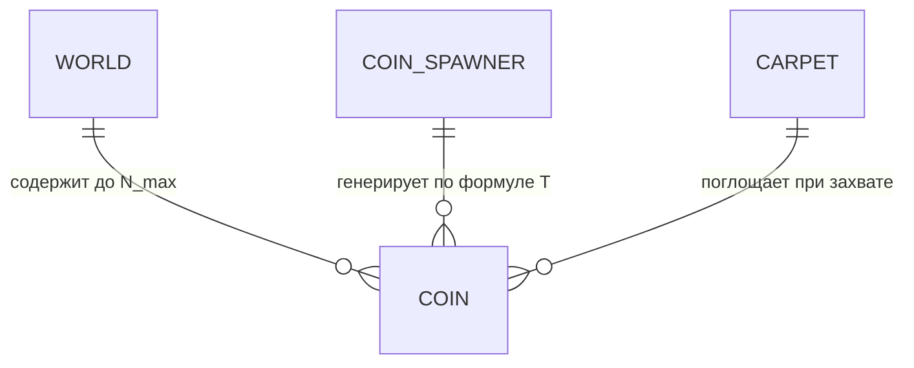
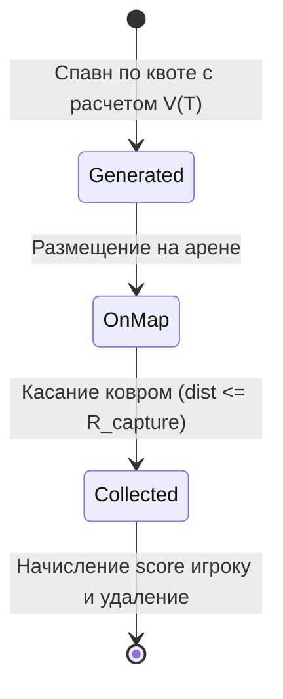

# DR-008: Сокровища, динамическая экономика монет и временное масштабирование ценности (Coin Economy)

## 1. Бизнес-контекст

**Проблема / Возможность:**  
Статичные сокровища с постоянным номиналом приводят к угасанию соревновательного интереса на поздних стадиях матча и не создают стимула для агрессивной борьбы в концовке игры. Необходима динамическая экономическая модель, в которой ценность появляющихся сокровищ прогрессивно возрастает по ходу времени (тиков) матча, создавая камбэк-механики и накал конкуренции.

**Цель:**  
Формализовать правила генерации и поддержания квоты монет на карте, зафиксировать физическую природу монеты как нематериальной точки и определить математическую модель масштабирования номинала монеты в зависимости от прошедшего игрового времени (тиков симулятора).

**Пользователи / Роли:**  
- **Игровой агент (Бот команды)** — анализирует карту, выбирает наиболее ценные монеты и направляет ковры на их перехват.
- **Генератор монет (Coin Spawner)** — поддерживает лимит одновременных монет на арене и рассчитывает прогрессивный номинал при спавне.
- **Клиент визуализации** — отображает монеты разной ценности с визуальной градацией (размер, свечение, номинал).

**Ключевые метрики:**  
- Постоянство пула: количество монет на карте всегда стремится к $N_{max\_coins}$.
- Временная прогрессия: монотонный рост математического ожидания и максимума номинала монет с ростом номера тика $T$.

---

## 2. Сценарии использования

### 2.1 Основной сценарий (Happy Path)

| № | Участник | Действие | Результат |
|---|---|---|---|
| 1 | Генератор монет | На старте матча проверяет текущее число монет на арене ($N_{current} < N_{max\_coins}$) | Запускается процедура генерации недостающих монет |
| 2 | Генератор монет | Считывает текущий тик симуляции $T$ и генерирует случайную позицию $(x, y)$ | Выбираются случайные допустимые координаты внутри арены |
| 3 | Генератор монет | Вычисляет номинал монеты $V(T)$ по формуле временного масштабирования | Монета создается с актуальным номиналом и добавляется в мир |
| 4 | Ковер игрока | Приближается к монете на расстояние захвата ($d \le R_{capture}$) | Монета захватывается ковром и исчезает с арены |
| 5 | Система | Зачисляет номинал монеты на счет игрока-владельца ковра | На следующем тике генератор восполняет освободившееся место новой монетой |

### 2.2 Альтернативные сценарии

- **Сценарий A (Конкурентный захват монеты двумя коврами одновременно):** Два ковра разных игроков одновременно входят в радиус сбора $R_{capture}$ одной и той же монеты. Награда достается ковру, центр которого физически ближе к монете: $\text{dist}(C_1, M) < \text{dist}(C_2, M)$. Если дистанции равны с точностью до эпсилон, награда делится поровну либо отдается ковру с меньшим ID.
- **Сценарий B (Спавн монеты на поздней стадии матча):** На тике $T = 3000$ (спустя 10 минут) генерируется монета высокой ценности (эпический артефакт), за которую разворачивается решающее столкновение команд.

### 2.3 Исключительные ситуации (Error Path)

| Условие | Реакция системы |
|---|---|
| Случайная точка спавна попадает внутрь смертоносного ядра аномалии $R_{core}$ | Координаты перегенерируются, пока точка не окажется в безопасной зоне |
| Попытка повторного сбора уже утилизированной монеты на том же тике | Идемпотентная обработка: сбор регистрируется только один раз |

---

## 3. Функциональные требования

| ID | Требование | Приоритет | Примечание |
|---|---|---|---|
| FR-01 | На карте должно поддерживаться фиксированное максимальное одновременное количество монет $N_{max\_coins}$. | Must have | Константа конфигурации сервера (по умолчанию $10$..$15$ монет) |
| FR-02 | При сборе монеты генератор монет должен автоматически восполнять пул до $N_{max\_coins}$. | Must have | Непрерывный спавн взамен собранных |
| FR-03 | Каждая монета в пространстве симулятора является нематериальной точкой с координатами $(x, y)$. | Must have | Точечная геометрия с радиусом сбора ковром $R_{capture}$ |
| FR-04 | Координаты спавна монеты должны генерироваться случайно в пределах допустимой площади арены с безопасным отступом от краев. | Must have | $X \in [R_{margin}, \text{arena\_width} - R_{margin}]$, $Y \in [R_{margin}, \text{arena\_height} - R_{margin}]$ |
| FR-05 | Номинал монеты ($value$) должен рассчитываться с обязательной прогрессивной функциональной зависимостью от прошедшего игрового тика $T$. | Must have | Чем больше времени прошло с запуска матча, тем выше возможный максимальный номинал монеты |
| FR-06 | Формула номинала должна сочетать базовый уровень ценности, временной множитель от номера тика и псевдослучайную дисперсию. | Must have | Исключает предсказуемость точного номинала, сохраняя тренд роста |
| FR-07 | Снапшот состояния мира (`GET /api/game/state`) должен возвращать список всех активных монет с их координатами, уникальными ID и номиналами. | Must have | Контракт взаимодействия с клиентами |

---

## 4. Нефункциональные требования

| ID | Требование | Значение / Описание |
|---|---|---|
| NFR-01 | Скорость генерации монет | Алгоритм поиска свободной точки и расчета номинала $\le 0.05$ мс на монету |
| NFR-02 | Целочисленный номинал | Номинал монеты всегда является положительным целым числом ($value \in \mathbb{N}, value \ge 10$) |
| NFR-03 | Стабильность экономики | Ограничение сверху максимального номинала монеты $V_{cap}$ для предотвращения инфляционного слома баланса |

---

## 5. Бизнес-правила

1. **Правило квоты сокровищ:** На арене единовременно присутствует не более $N_{max\_coins}$ монет. Монеты не деспавнятся по таймауту, а остаются на карте до момента их сбора ковром.
2. **Правило нематериальности:** Монета не обладает массой, скоростью и коллизией отталкивания. Ковер беспрепятственно пролетает через монету, забирая ее в момент достижения дистанции $d \le R_{capture}$.
3. **Правило формулы прогрессивного номинала (Time-Scaled Value):** Номинал монеты, генерируемой на тике $T$, вычисляется по формуле:
   $$V(T) = V_{base} + \left\lfloor \alpha \cdot T^{\gamma} \right\rfloor + \text{Random}\left(0, \; V_{spread\_base} + \lfloor \beta \cdot T \rfloor\right)$$
   где:
   - $V_{base}$ — минимальный базовый номинал ранней игры (например, $20$ очков).
   - $\alpha, \gamma$ — коэффициенты прогрессивного роста гарантированного номинала от тика ($\gamma \approx 1.0$ или $1.1$).
   - $V_{spread\_base}, \beta$ — параметры случайного разброса удачи, позволяющие на поздних тиках выпадать сверхценным джекпот-монетам.
   - $V(T) \le V_{max\_cap}$ — предельный потолок ценности отдельной монеты (например, $1000$ очков).
4. **Правило однократного сбора:** Монета утилизируется в том же тике, в котором произошел ее захват.

---

## 6. Модель данных (логическая)

### Сущности

| Сущность | Описание | Ключевые атрибуты |
|---|---|---|
| `Coin` | Сокровище на игровой карте | `id`, `position: (x, y)`, `value: u32`, `spawn_tick: u64`, `tier: CoinTier` |
| `CoinTier` | Градация ценности монеты | `Common`, `Silver`, `Gold`, `Legendary` |
| `CoinSpawnerConfig` | Параметры генератора сокровищ | `max_coins: usize`, `base_value: u32`, `time_scaling_factor: f64`, `max_value_cap: u32` |

### Связи

### Статусная модель (жизненный цикл монеты)

---

## 7. API-контракты (со стороны бэкенда)

| Метод | Путь | Назначение | Параметры |
|---|---|---|---|
| GET | `/api/game/state` | Получить список активных монет на арене с их номиналами | Массив объектов `treasures: [{"id": "t_1", "position": {"x": 250, "y": 300}, "value": 75}, ...]` |

---

## 8. Критерии приёмки (Acceptance Criteria)

- [x] AC-01: На карте постоянно поддерживается ровно $N_{max\_coins}$ монет (при сборе немедленно генерируется новая).
- [x] AC-02: Монета спавнится в случайных координатах в пределах арены.
- [x] AC-03: Номинал монет на тике $T_2 > T_1$ статистически строго больше номинала монет на тике $T_1$.
- [x] AC-04: Монета представляет собой нематериальную точку и подбирается ковром при дистанции $d \le R_{capture}$.
- [x] AC-05: Сбор монеты начисляет точный номинал монеты на общий баланс очков игрока.

---

## 9. Вопросы и допущения

- **Ограничение максимального значения:** Чтобы соревнование не превращалось в случайный выигрыш от одной «гипер-монеты» на последнем тике, номинал ограничен $V_{max\_cap} = 1000$ очков.
- **Безопасная зона спавна:** Монеты не спавнятся в пределах 30 единиц от границы арены ($[30, W-30] \times [30, H-30]$), чтобы игрокам не приходилось рисковать вылетом за пределы карты при стандартном сборе.
