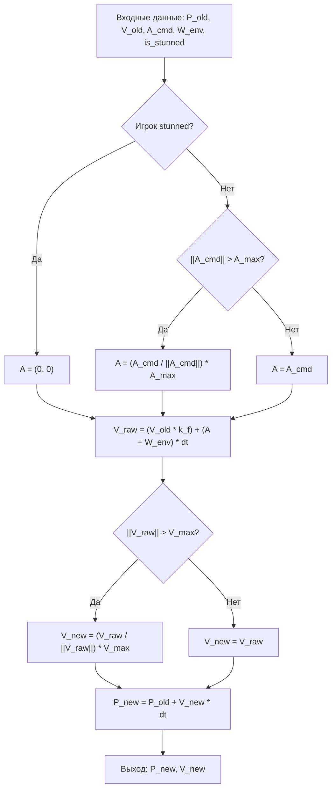

# FE-002: Модуль векторной математики и схема численного интегрирования Эйлера

> Описание технической реализации 2D векторной математики, затухания скорости от трения, ограничений ускорения/скорости и пошаговой схемы Эйлера на Rust.

---

## 1. Контекст и бизнес-цель

Фича отвечает за моделирование физического движения ковров-самолетов в 2D пространстве согласно спецификации [`docs/mechanics.md`](file:///Users/d.byta/Documents/Code/dats/datsmagic/docs/mechanics.md) и требованиям [`DR-002`](file:///Users/d.byta/Documents/Code/dats/datsmagic/docs/domain/DR-002-vector-physics.md). Физический движок должен быть максимально производительным, не производить аллокаций в куче и детерминированно рассчитывать координаты и скорости.

---

## 2. Архитектурное решение

Модуль состоит из двух ключевых компонентов:
1. `Vec2` — структура 2D-вектора с перегрузкой операторов (`Add`, `Sub`, `Mul`), функциями вычисления евклидовой нормы и нормализации.
2. `EulerIntegrator` — реализация интерфейса `PhysicsIntegrator`, выполняющая шаг численного интегрирования.

### Схема вычислительного конвейера шага физики



---

## 3. Модели и структуры данных (Rust)

```rust
use std::ops::{Add, Mul, Sub};

/// Двумерный вектор с компонентами f64
#[derive(Clone, Copy, Debug, PartialEq, Default, serde::Serialize, serde::Deserialize)]
pub struct Vec2 {
    pub x: f64,
    pub y: f64,
}

impl Vec2 {
    pub const ZERO: Self = Self { x: 0.0, y: 0.0 };

    #[inline]
    pub fn new(x: f64, y: f64) -> Self {
        Self { x, y }
    }

    #[inline]
    pub fn length_squared(self) -> f64 {
        self.x * self.x + self.y * self.y
    }

    #[inline]
    pub fn length(self) -> f64 {
        self.length_squared().sqrt()
    }

    #[inline]
    pub fn normalize_or_zero(self) -> Self {
        let len = self.length();
        if len > 1e-9 {
            Self { x: self.x / len, y: self.y / len }
        } else {
            Self::ZERO
        }
    }

    #[inline]
    pub fn clamp_length(self, max_len: f64) -> Self {
        if self.length_squared() > max_len * max_len {
            self.normalize_or_zero() * max_len
        } else {
            self
        }
    }
}

impl Add for Vec2 {
    type Output = Self;
    #[inline] fn add(self, rhs: Self) -> Self { Self::new(self.x + rhs.x, self.y + rhs.y) }
}

impl Sub for Vec2 {
    type Output = Self;
    #[inline] fn sub(self, rhs: Self) -> Self { Self::new(self.x - rhs.x, self.y - rhs.y) }
}

impl Mul<f64> for Vec2 {
    type Output = Self;
    #[inline] fn mul(self, rhs: f64) -> Self { Self::new(self.x * rhs, self.y * rhs) }
}
```

---

## 4. Алгоритмы и функции интегрирования

```rust
pub trait PhysicsIntegrator: Send + Sync {
    fn step(
        &self,
        position: Vec2,
        velocity: Vec2,
        command_accel: Vec2,
        environment_forces: Vec2,
        max_accel: f64,
        max_velocity: f64,
        friction: f64,
        dt: f64,
        is_stunned: bool,
    ) -> (Vec2, Vec2);
}

pub struct EulerIntegrator;

impl PhysicsIntegrator for EulerIntegrator {
    fn step(
        &self,
        position: Vec2,
        velocity: Vec2,
        command_accel: Vec2,
        environment_forces: Vec2,
        max_accel: f64,
        max_velocity: f64,
        friction: f64,
        dt: f64,
        is_stunned: bool,
    ) -> (Vec2, Vec2) {
        // Шаг 1: Валидация ускорения
        let effective_accel = if is_stunned {
            Vec2::ZERO
        } else {
            command_accel.clamp_length(max_accel)
        };

        // Шаг 2 и 3: Обновление скорости с учетом трения и внешних сил
        let total_accel = effective_accel + environment_forces;
        let unconstrained_velocity = (velocity * friction) + (total_accel * dt);

        // Шаг 4: Ограничение скорости
        let new_velocity = unconstrained_velocity.clamp_length(max_velocity);

        // Шаг 5: Обновление позиции
        let new_position = position + (new_velocity * dt);

        (new_position, new_velocity)
    }
}
```

---

## 5. Обработка ошибок (Error Handling)

| Ситуация | Реакция системы |
| :--- | :--- |
| Попытка нормализовать вектор с длиной $\approx 0$ | Метод `normalize_or_zero` возвращает `Vec2::ZERO` без паники или `NaN` |
| Поступление параметров `NaN` или `Infinity` | Функция сбрасывает значение в `Vec2::ZERO` с предупреждением в лог |

---

## 6. План реализации

- [x] **Шаг 1:** Реализовать структуру `Vec2` и перегрузить базовые арифметические операторы.
- [x] **Шаг 2:** Реализовать методы `length`, `normalize_or_zero`, `clamp_length`.
- [x] **Шаг 3:** Описать трейт `PhysicsIntegrator` и реализовать `EulerIntegrator`.
- [x] **Шаг 4:** Написать unit-тесты на соблюдение всех физических ограничений.

---

## 7. Тестирование

### Unit-тесты
- `test_friction_decay`: при отсутствии ускорения начальная скорость $(10, 0)$ через 1 шаг становится $(10 \times 0.98, 0) = (9.8, 0)$.
- `test_acceleration_clamping`: при заявленном векторе $(10, 0)$ с $A_{max} = 5.0$ применяется вектор $(5.0, 0)$.
- `test_velocity_clamping`: при разгоне скорость никогда не превышает $V_{max} = 20.0$.
- `test_stunned_zeroes_accel`: при `is_stunned == true` переданный вектор ускорения игнорируется.

---

## История изменений

| Версия | Дата | Автор | Изменение |
| :--- | :--- | :--- | :--- |
| 1.0 | 2026-09-30 | AI Agent | Создание спецификации физического модуля и схемы Эйлера |
| 1.1 | 2026-09-30 | AI Agent | Реализация Vec2, EulerIntegrator, сил и интеграционных тестов |

