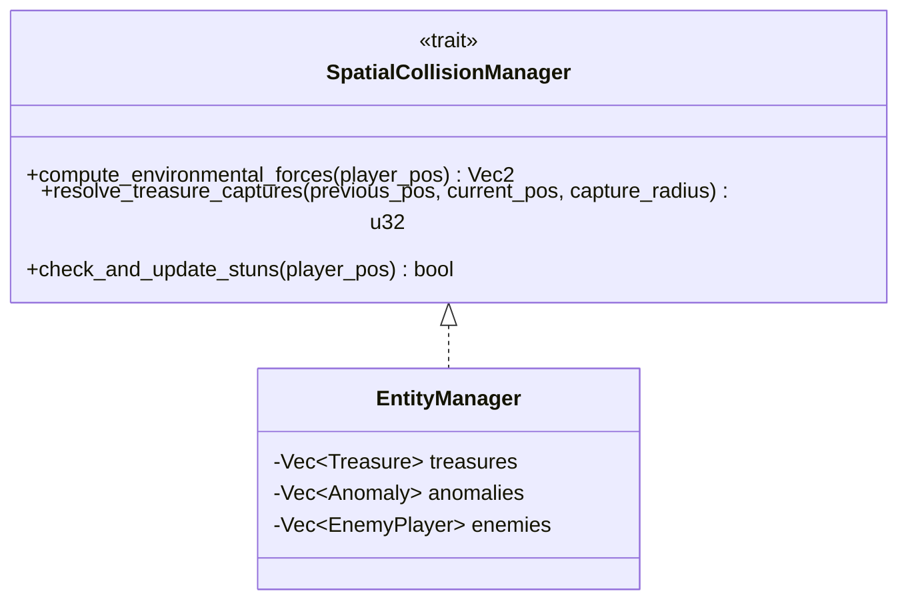

# FE-003: Подсистема управления пространственными сущностями и детекции коллизий

> Описание технической реализации менеджера пространственных объектов на карте, сбора сокровищ, гравитационного влияния песчаных вихрей и детекции столкновений на Rust.

---

## 1. Контекст и бизнес-цель

Фича реализует учет объектов игрового мира DatsMagic и их взаимных коллизий на 2D-карте. Модуль должен эффективно определять факт достижения сокровищ игроками, рассчитывать гравитационные силы вихрей-аномалий и контролировать статус оглушения ковров согласно спецификации [`docs/mechanics.md`](file:///Users/d.byta/Documents/Code/dats/datsmagic/docs/mechanics.md) и требованиям [`DR-003`](file:///Users/d.byta/Documents/Code/dats/datsmagic/docs/domain/DR-003-entity-interactions-and-collisions.md).

---

## 2. Архитектурное решение

Модуль инкапсулирует коллекции сущностей и реализует трейт `SpatialCollisionManager`. Для оптимизации вычислений все проверки расстояния до объектов производятся через сравнение квадратов расстояний ($d^2 \le R^2$).



---

## 3. Модели и структуры данных (Rust)

```rust
use crate::physics::Vec2;

/// Сокровище на карте
#[derive(Clone, Debug, serde::Serialize, serde::Deserialize)]
pub struct Treasure {
    pub id: String,
    pub r#type: String,
    pub position: Vec2,
    pub value: u32,
    pub is_collected: bool,
}

/// Аномалия / Песчаный вихрь
#[derive(Clone, Debug, serde::Serialize, serde::Deserialize)]
pub struct Anomaly {
    pub id: String,
    pub position: Vec2,
    pub radius: f64,
    pub force: f64,
}

/// Состояние игрока
#[derive(Clone, Debug, serde::Serialize, serde::Deserialize)]
pub struct PlayerEntity {
    pub id: String,
    pub score: u32,
    pub status: String, // "normal" | "stunned"
    pub position: Vec2,
    pub velocity: Vec2,
    pub max_acceleration: f64,
    pub max_velocity: f64,
    pub stun_remaining_ticks: u32,
}
```

---

## 4. Алгоритмы взаимодействия

### 4.1. Расчет суммарной силы вихрей
Для каждой аномалии $i$:
1. Вектор разности: $\Delta \vec{P} = \vec{P}_{anomaly} - \vec{P}_{player}$.
2. Квадрат расстояния: $d^2 = \Delta \vec{P}.\text{length\_squared}()$.
3. Если $d^2 \le R_{anomaly}^2$:
   - Единичный вектор: $\vec{u} = \Delta \vec{P}.\text{normalize\_or\_zero}()$.
   - Сила вихря: $\vec{w}_i = \vec{u} \cdot F_{pull}$.
4. Результирующий вектор: $\vec{W} = \sum \vec{w}_i$.

### 4.2. Сбор сокровищ
1. Для каждого живого ковра получить предыдущую и текущую позиции за физический тик.
2. Вычислить минимальное расстояние от центра монеты до отрезка между позициями ковра; собрать монету, если $d_{segment} \le (R_{player}+R_{coin})$.
3. Если несколько ковров коснулись одной монеты за тик, награду получает ковер с минимальным расстоянием от траектории до центра монеты.
4. При срабатывании:
   - `player.score += treasure.value`;
   - Сокровище удаляется из активного пула карты.

---

## 5. Обработка ошибок (Error Handling)

| Ситуация | Реакция системы |
| :--- | :--- |
| Позиция игрока строго совпадает с центром аномалии ($\Delta \vec{P} = \vec{0}$) | Метод нормализации возвращает `Vec2::ZERO`, исключая деление на ноль |
| Несколько сокровищ захвачены в один тик | Игроку суммируются очки за все захваченные сокровища |

---

## 6. План реализации

- [x] **Шаг 1:** Реализовать структуры `Treasure`, `Anomaly` и `PlayerEntity`.
- [x] **Шаг 2:** Создать интерфейс `SpatialCollisionManager` и реализацию `EntityManager`.
- [x] **Шаг 3:** Реализовать метод вычисления внешних сил $\vec{W} = \sum \vec{w}_i$.
- [x] **Шаг 4:** Реализовать логику сбора сокровищ и удаления их из карты.
- [x] **Шаг 5:** Покрыть unit-тестами точность расчета сил и коллизий.

---

## 7. Тестирование

### Unit-тесты
- `test_anomaly_pull_direction`: вектор силы направлен строго к центру вихря.
- `test_anomaly_zero_force_outside_radius`: вне зоны $R_{anomaly}$ сила равна $(0, 0)$.
- `test_treasure_collected_within_radius`: касание круга монеты эффективным радиусом ковра начисляет очки.
- `test_treasure_swept_collision_between_tick_endpoints`: пересечение радиусов между концами тика собирает сокровище.
- `test_treasure_not_collected_outside_radius`: если отрезок движения остаётся снаружи суммы радиусов, счет не меняется.

---

## История изменений

| Версия | Дата | Автор | Изменение |
| :--- | :--- | :--- | :--- |
| 1.0 | 2026-09-30 | AI Agent | Создание спецификации пространственных сущностей и коллизий |
| 1.1 | 2026-09-30 | AI Agent | Реализация EntityManager, WorldSpatialEngine, коллизий и интеграции с физикой |
| 1.2 | 2026-10-02 | Codex | Сбор монеты специфицирован по касанию суммы радиусов на отрезке движения за тик. |
