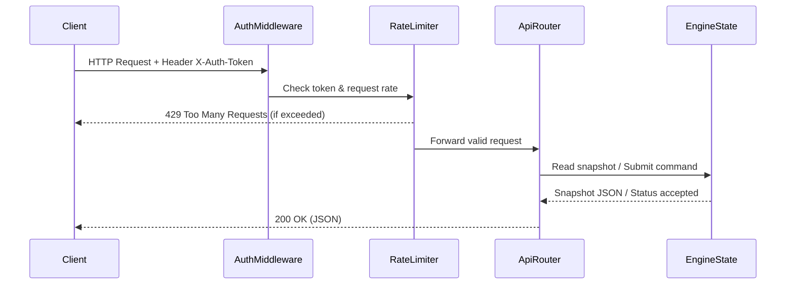

# FE-004: REST API эндпоинты состояния мира и управления ковром

> Описание реализации сетевого интерфейса HTTP REST API на фреймворке Axum на языке Rust, валидации команд, авторизации по токену и обработки Rate Limit.

---

## 1. Контекст и бизнес-цель

Фича обеспечивает сетевое взаимодействие игроков и клиента визуализации с игровым сервером DatsMagic согласно контрактам из [`docs/mechanics.md`](file:///Users/d.byta/Documents/Code/dats/datsmagic/docs/mechanics.md#4-контракты-api-спецификация-json) и требованиям [`DR-001`](file:///Users/d.byta/Documents/Code/dats/datsmagic/docs/domain/DR-001-game-loop-and-state.md).

---

## 2. Архитектурное решение

Сетевой слой реализуется с использованием веб-фреймворка `axum` и асинхронного парсера `serde_json`.



---

## 3. Спецификация DTO (Rust)

```rust
use serde::{Deserialize, Serialize};
use crate::physics::Vec2;
use crate::spatial::{Treasure, Anomaly};

/// Запрос команды игрока
#[derive(Deserialize, Debug)]
pub struct CommandRequestDto {
    pub acceleration: Vec2,
}

/// Подтверждение приема команды
#[derive(Serialize, Debug)]
pub struct CommandResponseDto {
    pub status: &'static str, // "accepted"
}

/// Снимок состояния для ответа GET /api/game/state
#[derive(Serialize, Debug)]
pub struct GameStateResponseDto {
    pub tick: u64,
    pub game_status: String,
    pub player: PlayerDto,
    pub treasures: Vec<Treasure>,
    pub anomalies: Vec<Anomaly>,
    pub enemies: Vec<EnemyDto>,
}

#[derive(Serialize, Debug)]
pub struct PlayerDto {
    pub id: String,
    pub score: u32,
    pub status: String,
    pub position: Vec2,
    pub velocity: Vec2,
    pub max_acceleration: f64,
    pub max_velocity: f64,
}

#[derive(Serialize, Debug)]
pub struct EnemyDto {
    pub id: String,
    pub position: Vec2,
    pub velocity: Vec2,
}
```

---

## 4. Эндпоинты API

| Метод | Путь | Описание | Заголовки |
| :--- | :--- | :--- | :--- |
| `GET` | `/api/game/state` | Получение текущего состояния симуляции | `X-Auth-Token: <token>` |
| `POST` | `/api/carpet/command` | Отправка вектора ускорения на текущий тик | `X-Auth-Token: <token>`, `Content-Type: application/json` |

---

## 5. Обработка ошибок и HTTP статусы

| Код ошибки | Статус | Условие возникновения | Формат ответа |
| :--- | :--- | :--- | :--- |
| `200 OK` | Успех | Корректный запрос | JSON-ответ |
| `400 Bad Request` | Неверный запрос | Поля `x`, `y` содержат `NaN`, `Infinity` или неверный тип | `{"error": "invalid vector values"}` |
| `401 Unauthorized` | Ошибка авторизации | Отсутствует или неверен заголовок `X-Auth-Token` | `{"error": "unauthorized"}` |
| `429 Too Many Requests` | Превышен лимит | Отправлено $>1$ команды за один тик | `{"error": "rate limit exceeded: 1 command per tick"}` |

---

## 6. План реализации

- [x] **Шаг 1:** Сконфигурировать маршрутизатор `axum::Router`.
- [x] **Шаг 2:** Реализовать middleware валидации заголовка `X-Auth-Token`.
- [x] **Шаг 3:** Реализовать обработчик `GET /api/game/state`.
- [x] **Шаг 4:** Реализовать обработчик `POST /api/carpet/command` с проверкой на дублирование за тик.
- [x] **Шаг 5:** Написать e2e-тесты на проверку кодов ответов HTTP.

---

## 7. Тестирование

### Unit- и E2E-тесты
- `test_unauthorized_without_token`: запрос без `X-Auth-Token` возвращает HTTP 401.
- `test_nan_vector_rejected`: команда с `{"x": "NaN"}` отклоняется с кодом 400.
- `test_command_rate_limit_429`: две последовательные команды в рамках одного тика возвращают 429 на второй запрос.
- `test_get_game_state_format`: возвращаемый JSON полностью валидируется по схеме `docs/mechanics.md`.

---

## История изменений

| Версия | Дата | Автор | Изменение |
| :--- | :--- | :--- | :--- |
| 1.0 | 2026-09-30 | AI Agent | Спецификация сетевых эндпоинтов и обработки запросов |
| 1.1 | 2026-09-30 | AI Agent | Реализация REST API на Axum, DTO, auth middleware, rate limit и e2e-тестов |
