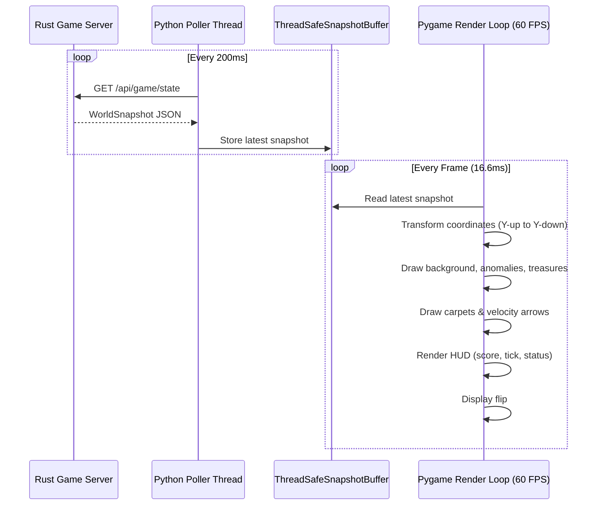

# FE-005: Графический клиент 2D-визуализации симуляции на Python

> Описание технической реализации автономного визуализатора игрового поля на Python с использованием библиотеки Pygame, отображением векторов скоростей, аномалий и HUD.

---

## 1. Контекст и бизнес-цель

Фича реализует инструмент наблюдения и отладки игрового процесса DatsMagic в реальном времени. Приложение опрашивает сервер по REST API и отрисовывает динамику движения ковров, векторы скорости, радиусы затягивания аномалий и сокровища согласно требованиям [`DR-004`](file:///Users/d.byta/Documents/Code/dats/datsmagic/docs/domain/DR-004-simulation-visualization.md).

---

## 2. Архитектурное решение

Визуализатор построен на архитектуре с разделением сетевого ввода/вывода и графического конвейера:
1. **Сетевой воркер (Network Poller Thread)**: в фоновом потоке запрашивает `GET /api/game/state` с периодом 200 мс и обновляет атомарную ссылку на снимок сцены.
2. **Графический движок (Pygame Render Loop)**: работает на частоте 60 FPS, выполняя трансформацию координат и плавную интерполяцию.



---

## 3. Проекция координат и структуры данных

В декартовой системе сервера ось $Y$ направлена вверх, а в экранных координатах компьютерной графики — вниз.

```python
from dataclasses import dataclass
from typing import Tuple

@dataclass
class Camera:
    offset_x: float = 0.0
    offset_y: float = 0.0
    zoom: float = 1.0
    screen_width: int = 1280
    screen_height: int = 720

    def world_to_screen(self, wx: float, wy: float) -> Tuple[int, int]:
        """Преобразование мировой координаты (Y вверх) в экранную (Y вниз)."""
        sx = int((wx - self.offset_x) * self.zoom + self.screen_width / 2)
        sy = int((self.screen_height / 2) - (wy - self.offset_y) * self.zoom)
        return sx, sy
```

---

## 4. Алгоритмы отрисовки элементов

1. **Отрисовка вектора скорости:**
   - Начало стрелки: экранные координаты центра ковра $(sx, sy)$.
   - Конец стрелки: проекция точки $(wx + v_x \cdot s, wy + v_y \cdot s)$, где $s$ — коэффициент масштабирования стрелки для наглядности.
2. **Отрисовка аномалии:**
   - Полупрозрачная окружность радиусом $R_{anomaly} \cdot zoom$.
   - Центральный маркер и спиралевидные/концентрические линии для индикации направления силы $F_{pull}$.
3. **Отрисовка статуса:**
   - При `player.status == "stunned"` ковёр подсвечивается мигающим красным ореолом с надписью `STUNNED`.

---

## 5. Обработка ошибок (Error Handling)

| Ситуация | Реакция клиента |
| :--- | :--- |
| Сервер еще не запущен или упал | Отображение сообщения "Connecting to server..." и повторный опрос с интервалом 1 сек |
| Битый JSON или ошибки декодирования | Логирование ошибки и сохранение предыдущего кадра сцены |

---

## 6. План реализации

- [x] **Шаг 1:** Создать структуру каталога клиента `/visualizer`.
- [x] **Шаг 2:** Написать сетевой клиент `ApiClient` с использованием `requests` / `httpx`.
- [x] **Шаг 3:** Реализовать модуль трансформации координат `Camera`.
- [x] **Шаг 4:** Реализовать отрисовку сущностей (ковры, стрелки скоростей, вихри, сокровища, HUD).
- [x] **Шаг 5:** Добавить обработку горячих клавиш (зум `+/-`, панорамирование стрелками, пробел для слежения за игроком).

---

## 7. Тестирование

### Unit-тесты
- `test_world_to_screen_inversion`: проверка того, что точка с большим $Y$ отображается выше по экрану (с меньшим экранным $y$).
- `test_camera_zoom`: проверка масштабирования расстояний при зуме.

---

## История изменений

| Версия | Дата | Автор | Изменение |
| :--- | :--- | :--- | :--- |
| 1.0 | 2026-09-30 | AI Agent | Спецификация графического клиента визуализации на Python |
| 1.1 | 2026-09-30 | AI Agent | Реализация Pygame визуализатора, Camera, SceneRenderer, HudRenderer, ApiClient и тестов |
