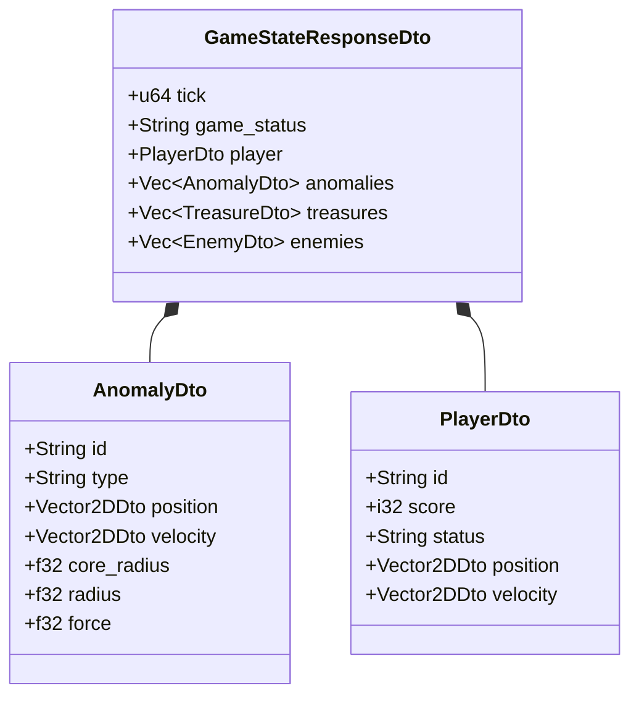

# FE-007: Контракты REST API и DTO для динамических аномалий и статуса уничтожения ковра (Dynamic Anomalies REST API & Telemetry)

> Техническая спецификация обновления контрактов сетевого протокола REST API и структур DTO для передачи клиентам расширенной информации о динамических аномалиях (тип, ядро, вектор скорости) и статусе гибели ковра игрока.

---

## 1. Контекст и бизнес-цель

Для того чтобы внешние клиенты (визуализаторы, боты-агенты) могли ориентироваться в изменяющемся окружении, предсказывать движение вихрей и своевременно реагировать на угрозы уничтожения, серверный API должен передавать расширенный контекст каждой аномалии. Также необходимо передавать статус уничтожения ковра (`destroyed`) в телеметрии игрока, если ковер коснулся ядра аномалии.

---

## 2. Архитектурное решение

Модуль `server::api` обновляет структуры передачи данных (`api::dto`), сериализуемые библиотекой `serde`, и обработчики эндпоинта `GET /api/game/state`.

### Изменения в API-контрактах:
1. **`AnomalyDto`**:
   - `type`: Строковый идентификатор типа воздействия (`"attracting"` или `"repelling"`).
   - `core_radius`: Число с плавающей точкой ($R_{core}$), определяющее смертоносную зону ядра.
   - `velocity`: Объект с координатами вектора скорости `{ "x": float, "y": float }`.
2. **`PlayerDto`**:
   - `status`: Поддержка нового строкового значения `"destroyed"` наряду с `"normal"` и `"stunned"`.



---

## 3. Схема DTO (Rust)

```rust
use serde::{Deserialize, Serialize};
use crate::physics::vector2d::Vector2D;

/// DTO двухмерного вектора.
#[derive(Debug, Clone, Serialize, Deserialize, PartialEq)]
pub struct Vector2DDto {
    pub x: f32,
    pub y: f32,
}

impl From<Vector2D> for Vector2DDto {
    fn from(v: Vector2D) -> Self {
        Self { x: v.x, y: v.y }
    }
}

/// DTO динамической аномалии для сетевого протокола.
#[derive(Debug, Clone, Serialize, Deserialize, PartialEq)]
pub struct AnomalyDto {
    pub id: String,
    #[serde(rename = "type")]
    pub anomaly_type: String, // "attracting" | "repelling"
    pub position: Vector2DDto,
    pub velocity: Vector2DDto,
    pub core_radius: f32,
    pub radius: f32, // effect_radius
    pub force: f32,
}

/// DTO состояния игрока с поддержкой статуса гибели.
#[derive(Debug, Clone, Serialize, Deserialize, PartialEq)]
pub struct PlayerDto {
    pub id: String,
    pub score: i32,
    pub status: String, // "normal" | "stunned" | "destroyed"
    pub position: Vector2DDto,
    pub velocity: Vector2DDto,
    pub max_acceleration: f32,
    pub max_velocity: f32,
}
```

---

## 4. Спецификация эндпоинта `GET /api/game/state`

- **Метод**: `GET`
- **Путь**: `/api/game/state`
- **Заголовок**: `X-Auth-Token: <string>`
- **Код ответа**: `200 OK`

### Пример ответа JSON:

```json
{
  "tick": 420,
  "game_status": "active",
  "player": {
    "id": "team_1",
    "score": 120,
    "status": "destroyed",
    "position": { "x": 340.5, "y": 720.0 },
    "velocity": { "x": 0.0, "y": 0.0 },
    "max_acceleration": 5.0,
    "max_velocity": 20.0
  },
  "treasures": [
    {
      "id": "t_1",
      "type": "chest",
      "position": { "x": 200.0, "y": 500.0 },
      "value": 50
    }
  ],
  "anomalies": [
    {
      "id": "a_dyn_1",
      "type": "attracting",
      "position": { "x": 350.0, "y": 725.0 },
      "velocity": { "x": 5.0, "y": -1.2 },
      "core_radius": 15.0,
      "radius": 80.0,
      "force": 4.5
    },
    {
      "id": "a_dyn_2",
      "type": "repelling",
      "position": { "x": 100.0, "y": 900.0 },
      "velocity": { "x": -2.0, "y": 3.0 },
      "core_radius": 12.0,
      "radius": 60.0,
      "force": 3.0
    }
  ],
  "enemies": []
}
```

---

## 5. Обработка ошибок (Error Handling)

| Исключительная ситуация | Поведение эндпоинта |
|---|---|
| Попытка отправить команду от уничтоженного игрока (`POST /api/carpet/command`) | Возврат HTTP `400 Bad Request` или игнорирование команды с предупреждением `{"error": "player_destroyed"}` |
| Ошибка конвертации или сериализации DTO | HTTP `500 Internal Server Error` с логированием ошибки |

---

## 6. План реализации

- [x] **Шаг 1:** Обновить структуру `AnomalyDto` в `server/src/api/dto.rs`, добавив поля `type`, `core_radius`, `velocity`.
- [x] **Шаг 2:** Обновить логику маппинга состояния игры в DTO в `server/src/api/handlers.rs`.
- [x] **Шаг 3:** Добавить валидацию статуса `destroyed` в `POST /api/carpet/command` для блокировки управляющих команд погибшего ковра.
- [x] **Шаг 4:** Обновить интеграционные тесты API в `server/tests/api_tests.rs` с проверкой корректности сериализации новых полей.

---

## 7. Тестирование

### Unit-тесты
- `test_anomaly_dto_serialization_roundtrip`: проверка сериализации и десериализации объекта `AnomalyDto` с новыми полями.
- `test_player_dto_destroyed_status`: проверка валидной сериализации статуса `status: "destroyed"`.

### Интеграционные тесты
- `test_get_game_state_with_dynamic_anomalies`: отправка HTTP `GET /api/game/state` и валидация схемы JSON-ответа с динамическими аномалиями.

---

## История изменений

| Версия | Дата | Автор | Изменение |
|---|---|---|---|
| 1.0 | 2026-09-30 | Lead Architect & AI Agent | Начальная спецификация расширения REST API для динамических аномалий и гибели ковра |
