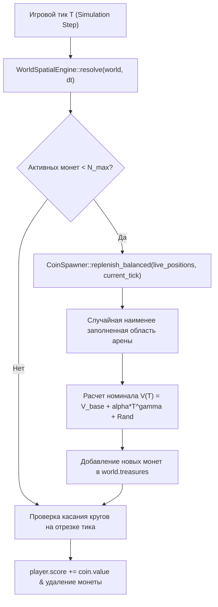

# FE-009: Динамический генератор монет с прогрессивным масштабированием номинала от игрового тика (Progressive Coin Spawner)

## 1. Контекст и бизнес-цель

В соответствии с [`DR-008`](file:///Users/d.byta/Documents/Code/dats/datsmagic/docs/domain/DR-008-treasure.md) на карте поддерживается настраиваемая квота монет из профиля мира. Квоты намеренно сильно различаются: бедные арены — около 500–1 000, обычные — 4 000–7 000, богатые — до 12 000. Область нового спавна выбирается с учетом плотности оставшихся монет; цена монеты прогрессивно растет по игровым тикам.

Цель данной фичи — реализовать модуль `CoinSpawner`, обеспечивающий автоматическое восполнение монет с пространственной обратной связью: новые монеты направляются в наименее заполненные области, компенсируя постепенную очистку популярных маршрутов. Номинал по-прежнему рассчитывается по формуле временного масштабирования $V(T)$.

---

## 2. Архитектурное решение

Модуль генератора монет интегрируется в `WorldSpatialEngine` аналогично `AnomalySpawner`. Чтобы высокая квота не замедляла тик квадратичным поиском, наименее заполненная область выбирается через корзины по текущей заполненности: после выбора корзина ячейки обновляется за амортизированное O(1), а не полным сканированием всей сетки для каждой монеты. Инициализация карты имеет сложность O(quota + cells); локальное восполнение не пересканирует все ячейки.



### 2.1 Математическая модель расчета номинала

Номинал монеты $V(T)$ на тике $T$:
$$V(T) = \min\left(V_{max\_cap}, \; V_{base} + \lfloor \alpha \cdot T^{\gamma} \rfloor + \text{Random}\left(0, \; V_{spread\_base} + \lfloor \beta \cdot T \rfloor\right)\right)$$

Где:
- $V_{base} = 25$
- $\alpha = 0.05, \gamma = 1.05$
- $V_{spread\_base} = 20, \beta = 0.1$
- $V_{max\_cap} = 1000$

### 2.2 Градация монет по ценности (Coin Tier)
- **Common (Бронза):** $V < 100$
- **Silver (Серебро):** $100 \le V < 250$
- **Gold (Золото):** $250 \le V < 500$
- **Legendary (Эпик/Рубин):** $V \ge 500$

---

## 3. Структуры данных (Rust)

```rust
#[derive(Clone, Debug, Serialize, Deserialize)]
pub struct CoinSpawnerConfig {
    pub max_coins: usize,
    pub base_value: u32,
    pub arena_width: f64,
    pub arena_height: f64,
    pub margin: f64,
    pub max_value_cap: u32,
}

impl Default for CoinSpawnerConfig {
    fn default() -> Self {
        Self {
            max_coins: 1000,
            base_value: 25,
            arena_width: 1000.0,
            arena_height: 1000.0,
            margin: 40.0,
            max_value_cap: 1000,
        }
    }
}

pub struct CoinSpawner {
    config: CoinSpawnerConfig,
    counter: u64,
}
```

---

## 4. План реализации

1. **Создание модуля `lib/arena-server/src/spatial/coin_spawner.rs`**:
   - Реализация структуры `CoinSpawner` с методами `new`, `spawn_one(tick)` и `replenish_balanced_avoiding_anomalies(live_positions, tick, anomalies)`.
   - Генерация координат внутри случайно выбранной наименее заполненной равноплощадной области, в пределах безопасного отступа.
   - Формула расчета номинала с зависимостью от $T$.
2. **Интеграция в `WorldSpatialEngine`**:
   - Добавление `coin_spawner: Option<CoinSpawner>` в `WorldSpatialEngine`.
   - Автоматический вызов пополнения пула монет на каждом тике в `resolve()`.
3. **Обновление `ServerConfig` и `main.rs`**:
   - Добавление флага `enable_coin_spawner: bool` (по умолчанию `true` в `main.rs`).

---

## 5. Тестовые сценарии

- `TC-COIN-01`: Проверка поддержания постоянной квоты: при удалении монет генератор восполняет их ровно до $N_{max\_coins}$.
- `TC-COIN-02`: Проверка временной прогрессии: математическое ожидание номинала на тике $T=2000$ строго превышает номинал на тике $T=10$.
- `TC-COIN-03`: Проверка диапазона координат: все сгенерированные монеты находятся строго внутри арены с отступом $margin$.
- `TC-COIN-04`: При восполнении монетами область с меньшим числом активных монет выбирается раньше более заполненной; при равной заполненности возможен случайный выбор.
- `TC-COIN-05`: После многократного сбора в одной области и восполнения распределение постепенно выравнивается, а общее число монет не превышает квоту.
- `TC-COIN-06`: Восполнение большой квоты (12 000) сохраняет равномерный выбор наименее занятой ячейки без полного сканирования ячеек на каждую добавляемую монету.

## История изменений

| Версия | Дата | Автор | Изменение |
|---|---|---|---|
| 1.1 | 2026-10-02 | Codex | Квота по умолчанию снижена до 1000 активных монет. |
| 1.3 | 2026-10-02 | Codex | Восполнение учитывает фактическое распределение и направляет монеты в наименее заполненные области арены. |
| 1.4 | 2026-10-03 | Codex | Добавлены широко варьируемые квоты до 12 000 и bucket-индекс заполненности для эффективного массового спавна. |
