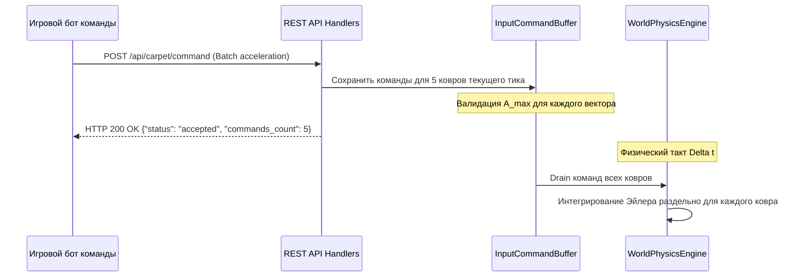

# FE-010: Управление флотом из 5 ковров игрока и пакетный REST API команд (Fleet Management)

## 1. Контекст и бизнес-цель

Согласно [`DR-007`](file:///Users/d.byta/Documents/Code/dats/datsmagic/docs/domain/DR-007-player.md), каждый игрок управляет не одним ковром, а флотом из 5 ковров одновременно. Игровой агент должен иметь возможность на каждом такте симуляции передавать раздельные векторы управляющего ускорения $\vec{A}_i$ для каждого из своих ковров.

Цель фичи — расширить модель данных игрока на сервере до флота из 5 ковров, обновить сетевые DTO и реализовать пакетную обработку команд в `InputCommandBuffer` и `WorldPhysicsEngine`.

---

## 2. Архитектурное решение



### 2.1 Идентификаторы ковров флота
Каждый ковер получает детерминированный составной идентификатор:
`{player_id}_{index}`, где `index` $\in [0, 4]$. Например, для игрока `"team_alpha"` ковры именуются:
- `"team_alpha_0"`
- `"team_alpha_1"`
- `"team_alpha_2"`
- `"team_alpha_3"`
- `"team_alpha_4"`

### 2.2 Сетевой контракт запроса команд (DTO)

```json
{
  "commands": [
    {"carpet_id": "team_alpha_0", "acceleration": {"x": 2.0, "y": 1.0}},
    {"carpet_id": "team_alpha_1", "acceleration": {"x": -1.5, "y": 3.0}},
    {"carpet_id": "team_alpha_2", "acceleration": {"x": 0.0, "y": -4.0}},
    {"carpet_id": "team_alpha_3", "acceleration": {"x": 4.5, "y": 0.0}},
    {"carpet_id": "team_alpha_4", "acceleration": {"x": -2.0, "y": -2.0}}
  ]
}
```

*Обратная совместимость:* Если клиент передает единичный объект `{"acceleration": {"x": ..., "y": ...}}`, сервер применяет это ускорение ко всем живым коврам флота игрока либо к первому ковру `"team_alpha_0"`.

### 2.3 Сетевой контракт ответа состояния (`GET /api/game/state`)

```json
{
  "tick": 420,
  "game_status": "active",
  "player": {
    "id": "team_alpha",
    "score": 1250,
    "carpets": [
      {
        "id": "team_alpha_0",
        "status": "normal",
        "position": {"x": 450.0, "y": 480.0},
        "velocity": {"x": 3.2, "y": -1.1},
        "max_acceleration": 5.0,
        "max_velocity": 20.0
      }
    ]
  },
  "enemies": [
    {
      "id": "team_beta",
      "carpets": [
        {
          "id": "team_beta_0",
          "position": {"x": 720.0, "y": 610.0},
          "velocity": {"x": -5.0, "y": 0.0}
        }
      ]
    }
  ],
  "treasures": [],
  "anomalies": []
}
```

---

## 3. План реализации

1. **Обновление `PlayerState` и структур ковра в `server/src/engine/state.rs`**:
   - Выделение отдельной сущности `CarpetState` с позицией, скоростью, ускорением и статусом.
   - `PlayerState` хранит `id: String`, `score: i64`, `carpets: HashMap<String, CarpetState>`.
2. **Обновление `server/src/engine/command_buffer.rs`**:
   - Поддержка хранения команд по ключу `carpet_id`.
3. **Обновление `WorldPhysicsEngine`**:
   - Итерация по всем коврам всех игроков для расчета Эйлера и суперпозиции внешних сил.
4. **Обновление DTO в `server/src/api/dto.rs` и обработчиков в `handlers.rs`**.

---

## 4. Тестовые сценарии

- `TC-FLEET-01`: При автоматической регистрации нового игрока создаются ровно 5 ковров.
- `TC-FLEET-02`: Пакетная отправка команд раздельно ускоряет ковер 0 и ковер 1 в противоположных направлениях.
- `TC-FLEET-03`: `GET /api/game/state` возвращает 5 ковров с корректными идентификаторами и позициями.
