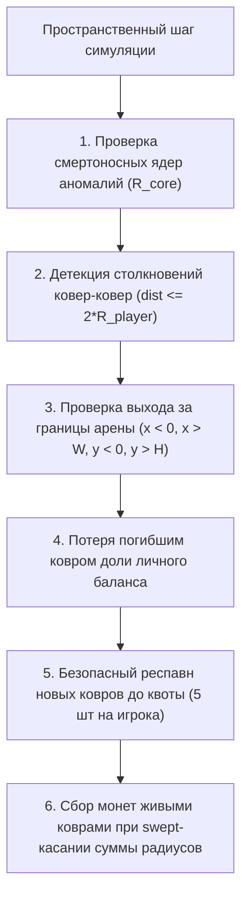

# FE-011: Механика летальных столкновений ковров, вылета за границы арены и штрафной баланс (Carpet Collisions & Penalties)

## 1. Контекст и бизнес-цель

Согласно спецификациям [`DR-006`](file:///Users/d.byta/Documents/Code/dats/datsmagic/docs/domain/DR-006-carpet.md) и [`DR-007`](file:///Users/d.byta/Documents/Code/dats/datsmagic/docs/domain/DR-007-player.md), игра накладывает жесткие соревновательные ограничения на безопасность перемещения:
1. **Столкновение любых двух ковров** (своих или чужих) приводит к их взаимному уничтожению.
2. **Вылет за прямоугольные границы арены** влечет немедленную смерть ковра.
3. **Любая гибель ковра** (включая ядро аномалии) наказывается списанием штрафных очков со счета игрока.
4. **Квота флота поддерживается непрерывным респавном** нового ковра в случайной безопасной точке арены.

Цель фичи — реализовать в `WorldSpatialEngine` фазу детекции столкновений между коврами, проверку выхода за границы арены, списание штрафов и алгоритм безопасного переспавна.

---

## 2. Архитектурное решение

### 2.1 Детекция взаимных столкновений ковров
Для всех пар активных ковров $(C_i, C_j)$ ($i \ne j$):
$$\text{Distance}^2(C_i.pos, C_j.pos) \le (2 \cdot R_{player})^2$$
Если условие выполнено, оба ковра помечаются как `destroyed` с причиной `Reason::CarpetCollision`.

### 2.2 Проверка границ арены
Для каждого активного ковра $C$:
$$\text{IsOutOfBounds}(C) = (C.x < 0.0) \lor (C.x > \text{arena\_width}) \lor (C.y < 0.0) \lor (C.y > \text{arena\_height})$$
Если `true`, ковер помечается как `destroyed` с причиной `Reason::OutOfBounds`.

### 2.3 Штрафная система
Каждый ковер имеет собственный кошелек `gold`. Подбор сокровища начисляет его номинал этому кошельку и агрегированному `player.score`. При переходе ковра в `destroyed` списывается доля только его баланса:
$$L = \left\lfloor gold_{carpet} \cdot loss\_percent / 100 \right\rfloor; \quad gold'_{carpet}=gold_{carpet}-L; \quad player.score'=player.score-L$$
`carpet_death_loss_percent` задаётся в `world.json`, по умолчанию 30. Оставшиеся 70% переносятся через same-tick respawn. Суммарный lifetime сбор ковра не уменьшается.

На каждом переходе ковра из живого состояния в `destroyed` его lifetime-счетчик `death_count` увеличивается ровно на 1. Счетчик не сбрасывается при мгновенном респавне, сохраняется за стабильным `carpet.id` и публикуется как `deathCount` в legacy transport DTO. Повторная обработка уже уничтоженного ковра не увеличивает счетчик.

### 2.4 Безопасный респавн
Погибший ковер заменяется новым с теми же `id`/`index` со сброшенной нулевой скоростью в случайных координатах $(x_{spawn}, y_{spawn})$, удовлетворяющих условиям:
1. $x_{spawn} \in [50.0, \text{arena\_width} - 50.0]$, $y_{spawn} \in [50.0, \text{arena\_height} - 50.0]$
2. Для всех аномалий: $\text{dist}((x, y), a.pos) > a.core\_radius + 50.0$
3. Для всех других живых ковров: $\text{dist}((x, y), c.pos) > 4 \cdot R_{player}$

---

## 3. План реализации

1. **Расширение `WorldSpatialEngine`**:
   - Метод `detect_carpet_collisions(players, player_radius) -> Vec<(String, String)>`.
   - Метод `detect_out_of_bounds(players, arena_width, arena_height) -> Vec<String>`.
   - Метод `apply_death_penalties(players, destroyed_carpets, penalty)`.
   - Метод `respawn_destroyed_carpets(world, spawner_rng)`.
2. **Интеграция в метод `resolve()`**:
   - Связывание всех фаз пространственного пересчета.
3. **Конфигурация параметров**:
   - `carpet_death_loss_percent: f64` в `world.json` (по умолчанию 30; допустимо 0–100).

---

## 4. Тестовые сценарии

- `TC-COLL-01`: При лобовом сближении двух ковров на дистанцию $< 2 \cdot R_{player}$ оба ковра уничтожаются.
- `TC-COLL-02`: Столкновение двух ковров одной команды наказывает игрока двойным штрафом (по $P_{death}$ за каждый ковер).
- `TC-COLL-03`: Ковер, оказавшийся за пределами арены ($x = -10.0$), немедленно уничтожается.
- `TC-COLL-04`: После гибели ковер переспавнивается в пределах арены на безопасном расстоянии от опасных зон.
- `TC-COLL-05`: `deathCount` увеличивается при каждой гибели, сохраняется после same-tick respawn и попадает в Desert `transports`.
- `TC-COLL-06`: гибель списывает процент только из кошелька погибшего ковра; остаток и lifetime-сбор сохраняются при респавне.

## История изменений

| Версия | Дата | Автор | Изменение |
|---|---|---|---|
| 1.2 | 2026-10-02 | Codex | `deathCount` теперь монотонно учитывает каждую гибель стабильного ID и возвращается в legacy API после немедленного респавна. |
| 1.3 | 2026-10-02 | Codex | Фиксированный штраф заменён на настраиваемую процентную потерю личного баланса погибшего ковра. |
