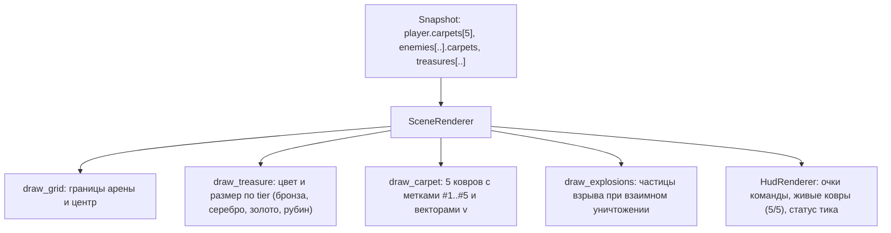

# FE-012: Визуализация флота из 5 ковров, столкновений и динамической градации монет (Fleet Visualization)

## 1. Контекст и бизнес-цель

С введением управления флотом из 5 ковров ([`DR-007`](file:///Users/d.byta/Documents/Code/dats/datsmagic/docs/domain/DR-007-player.md)) и прогрессивной экономики сокровищ ([`DR-008`](file:///Users/d.byta/Documents/Code/dats/datsmagic/docs/domain/DR-008-treasure.md)) графический клиент `visualizer/` должен наглядно представлять:
1. Все 5 ковров каждого игрока с удобной цифровой маркировкой (`#1` .. `#5`).
2. Разноцветную градацию монет в зависимости от их номинала (бронза, серебро, золото, рубин).
3. Анимацию взрыва и обломков при столкновении ковров и вылете за границы арены.
4. Расширенный HUD с метриками состава флота и общим балансом очков.

---

## 2. Архитектурное решение

### 2.1 Градация монет по цветам
- **Common ($V < 100$):** Бронзовая монета `(190, 110, 60)`
- **Silver ($100 \le V < 250$):** Серебряная светлая монета `(210, 220, 230)`
- **Gold ($250 \le V < 500$):** Сияющая золотая монета `(255, 215, 0)`
- **Legendary ($V \ge 500$):** Пурпурно-рубиновый сияющий артефакт `(220, 20, 60)` с пульсирующим ореолом

### 2.2 Маркировка ковров флота
Каждый ковер отображается как круговая точка-масса с ореолом, а внутри круга или над ним рисуется индекс ковра: `[#1]`, `[#2]`, `[#3]`, `[#4]`, `[#5]`, что позволяет оператору легко идентифицировать каждую единицу флота.

---

## 3. План реализации

- [x] **Шаг 1: Обновление `visualizer/visualizer/client.py`**:
  - Добавлены структуры `CarpetState` и `EnemyCarpetState` со статусами, флагами оглушения/уничтожения.
  - Поддержка структуры `carpets: List[CarpetState]` в `PlayerState` и `EnemyCarpetState` в `EnemyState`.
- [x] **Шаг 2: Обновление цветовой палитры в `visualizer/visualizer/config.py`**:
  - Цвета тиров сокровищ (`COIN_COMMON`, `COIN_SILVER`, `COIN_GOLD`, `COIN_LEGENDARY`, `COIN_LEGENDARY_HALO`, `COIN_SHINE`).
  - Цвета частиц взрывов (`EXPLOSION_FIRE`, `EXPLOSION_SPARK`, `EXPLOSION_SMOKE`).
- [x] **Шаг 3: Обновление `visualizer/visualizer/renderer.py`**:
  - Реализация отрисовки флота ковров игрока (`draw_player_fleet`) и противника (`draw_enemy_fleet`) с маркерами `#1`..`#5`.
  - Метод `_get_coin_tier_color(value: int)` и публичный `get_coin_tier_color(value: int)`.
  - Динамический размер монет и пульсирующий рубиновый ореол для легендарных сокровищ ($V \ge 500$).
  - Система частиц взрыва `ExplosionEffect` и автоматический триггер взрыва при переходе ковра в статус `destroyed`.
- [x] **Шаг 4: Обновление `visualizer/visualizer/hud.py`**:
  - Панель флота: индикаторы активности каждого из 5 ковров (`[#1]`..`[#5]`) с цветовой индикацией статуса (`normal`, `stunned`, `destroyed`).
  - Метрика `Fleet Status (X/5 active)`.

---

## 4. Тестовые сценарии

- [x] `TC-VIS-FLEET-01`: Headless-рендер корректно отображает 5 ковров управляемого игрока и ковры соперников без исключений (`test_tc_vis_fleet_01_render_player_and_enemy_fleets`).
- [x] `TC-VIS-COINS-01`: Монеты с номиналами 50, 150, 300, 750 отрисовываются соответствующими цветами палитры (`test_tc_vis_coins_01_progressive_coin_palette`).

---

## 5. История изменений

| Версия | Дата | Автор | Изменение |
|---|---|---|---|
| 1.0 | 2026-09-30 | Lead Architect & AI Agent | Начальная спецификация визуализации флота из 5 ковров и динамической градации монет |
| 1.1 | 2026-09-30 | AI Agent | Полная реализация и успешная валидация TC-VIS-FLEET-01 и TC-VIS-COINS-01 |
