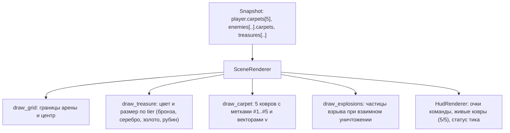

# FE-012: Визуализация флота из 5 ковров, столкновений и динамической градации монет (Fleet Visualization)

## 1. Контекст и бизнес-цель

С введением управления флотом из 5 ковров ([`DR-007`](file:///Users/d.byta/Documents/Code/dats/datsmagic/docs/domain/DR-007-player.md)) и прогрессивной экономики сокровищ ([`DR-008`](file:///Users/d.byta/Documents/Code/dats/datsmagic/docs/domain/DR-008-treasure.md)) графический клиент `visualizer/` должен наглядно представлять:
1. Все 5 ковров каждого игрока с удобной цифровой маркировкой (`#1` .. `#5`).
2. Разноцветную градацию монет в зависимости от их номинала (бронза, серебро, золото, рубин).
3. Анимацию взрыва и обломков при столкновении ковров и вылете за границы арены.
4. Расширенный HUD с метриками состава флота и общим балансом очков.

---

## 2. Архитектурное решение

### 2.1 Градация монет по цветам
- **Common ($V < 100$):** Бронзовая монета `(190, 110, 60)`
- **Silver ($100 \le V < 250$):** Серебряная светлая монета `(210, 220, 230)`
- **Gold ($250 \le V < 500$):** Сияющая золотая монета `(255, 215, 0)`
- **Legendary ($V \ge 500$):** Пурпурно-рубиновый сияющий артефакт `(220, 20, 60)` с пульсирующим ореолом

### 2.2 Маркировка ковров флота
Каждый ковер отображается как круговая точка-масса с ореолом, а внутри круга или над ним рисуется индекс ковра: `[#1]`, `[#2]`, `[#3]`, `[#4]`, `[#5]`, что позволяет оператору легко идентифицировать каждую единицу флота.

---

## 3. План реализации

1. **Обновление `visualizer/visualizer/client.py`**:
   - Поддержка структуры `carpets: List[CarpetState]` в `PlayerState` и `EnemyState`.
2. **Обновление `visualizer/visualizer/renderer.py`**:
   - Реализация отрисовки списка ковров с номерами.
   - Метод `_get_coin_tier_color(value: int)`.
   - Отрисовка взрыва взаимного столкновения двух ковров.
3. **Обновление `visualizer/visualizer/hud.py`**:
   - Панель флота: индикаторы активности каждого из 5 ковров (`[1] [2] [3] [4] [5]`).

---

## 4. Тестовые сценарии

- `TC-VIS-FLEET-01`: Headless-рендер корректно отображает 5 ковров управляемого игрока и ковры соперников без исключений.
- `TC-VIS-COINS-01`: Монеты с номиналами 50, 150, 300, 750 отрисовываются соответствующими цветами палитры.
