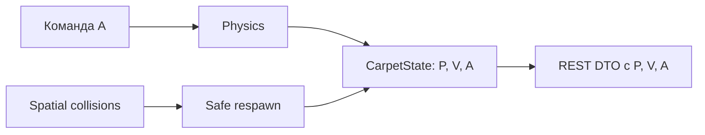

# FE-013: Непрерывный флот и статичная визуализация аномалий

## 1. Контекст и бизнес-цель

В демонстрационном режиме гибель одного ковра не должна останавливать наблюдение: ковер получает штраф и безопасно возвращается на карту. Сервер публикует телеметрию трех векторов состояния ковра. Требования к их отображению находятся в `visualizer_2/docs`.

## 2. Архитектурное решение

- Автоматический респавн включен в конфигурации по умолчанию.
- Проверка выхода за границу применяется к каждому живому ковру после физического шага; такой ковер уничтожается, штрафуется и в тот же тик респавнится.
- `CarpetState` и DTO получают `acceleration` — эффективное управляющее ускорение после нормализации и с учетом `stunned`; это третий наблюдаемый вектор наряду с положением `P` и скоростью `V`.
- Клиентское отображение векторов и аномалий определено в `visualizer_2/docs/features/FE-002-world-rendering.md`.

## 3. Алгоритмы и правила

1. До интегрирования вычислить `A_effective = clamp(A_command, A_max)`; при `stunned` использовать `(0,0)`.
2. Сохранить `A_effective` в состоянии ковра и передать клиенту API.
3. После физики проверить ядра, столкновения и `x < 0 || x > W || y < 0 || y > H`.
4. Для каждого уничтоженного ковра применить ровно один штраф и найти безопасную точку респавна.

## 4. Критерии приемки

- [ ] AC-01: При стандартной конфигурации уничтоженный ковер появляется снова внутри арены с нулевыми `V` и `A`.
- [ ] AC-02: Ковер за границей уничтожается и проходит тот же путь штрафа/респавна.
- [ ] AC-03: API отдает эффективное `acceleration` для каждого ковра.

## 5. Тестирование

- Rust: выход за границу и респавн по умолчанию; сохранение эффективного ускорения.
- Rust: API-тест проверяет сериализацию эффективного `acceleration`.

## История изменений

| Версия | Дата | Автор | Изменение |
|---|---|---|---|
| 1.0 | 2026-10-01 | Codex | Спецификация изменений по обратной связи пользователя. |
| 1.1 | 2026-10-01 | Codex | Уточнены начало вектора P, цвет вектора аномалии и вид ядра. |
