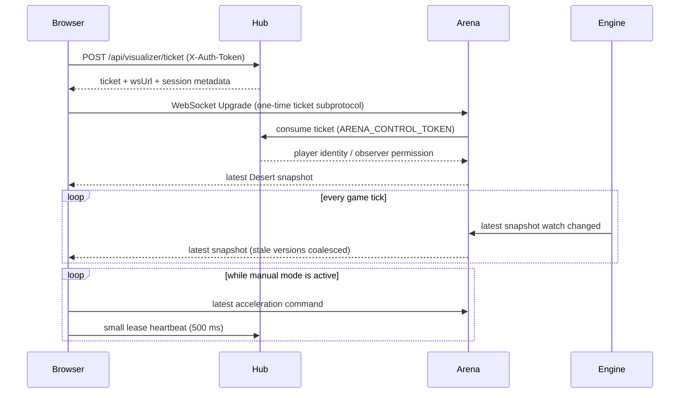

# FE-026: Realtime-канал веб-визуализатора

## 1. Контекст и цель

Браузерная арена сейчас использует синхронный цикл HTTP polling: каждые 200 мс Hub проксирует запрос в arena server, тот применяет ввод и только затем отдаёт полный снимок. Медленный ответ задерживает получение состояния и команд, вызывает таймауты и делает управление рваным. Требуется отдельный канал только для `/arena`; контракт игрового REST API для ботов не меняется.

## 2. Архитектурное решение

- Hub выдаёт краткоживущий одноразовый realtime-ticket через POST с `X-Auth-Token`; для наблюдателя тот же endpoint выдаёт read-only ticket. Реальный командный токен не попадает в URL, WebSocket payload или subprotocol.
- Клиент открывает WebSocket напрямую к активной арене и передаёт ticket в `Sec-WebSocket-Protocol` как одноразовую capability. Arena обменивает его у Hub по внутреннему endpoint, защищённому `ARENA_CONTROL_TOKEN`; ticket одноразовый и живёт не более 10 секунд.
- Arena публикует снапшот через `watch<Arc<WorldSnapshot>>`: медленный читатель получает актуальное состояние, пропуская промежуточные версии, без растущей очереди и задержки игрового цикла.
- Внутренний маршрут WebSocket — `/stream/visualizer`. Если публичный `ARENA_PUBLIC_URL` заканчивается на `/play` (префикс игрового REST API), arena также принимает alias `/play/stream/visualizer`; reverse proxy может как сохранять, так и снимать этот префикс при маршрутизации.
- Поток снапшотов отправляет текущий Desert DTO сразу после подключения и затем при завершении каждого тика (200 мс). Приемник не выполняет игровую симуляцию и не блокирует тик.
- Клиент рисует через существующий `requestAnimationFrame`; сетевой обработчик лишь заменяет latest snapshot. Интерполяция сглаживает отображение, но не влияет на физику.
- Сообщения ввода содержат только `{transports:[{id,acceleration}]}`. Arena проверяет ownership, живой статус, finite-значения и активность сессии. В пределах тика повторные realtime-команды коалесцируются: применяется последняя принятая команда ковра. REST-бот сохраняет прежний лимит одной batch-команды на тик и прежний HTTP-контракт.
- Пока ручное управление включено, клиент продлевает существующий lease отдельным малым HTTP heartbeat раз в 500 мс; lease имеет короткий TTL. При disconnect поток закрывается, lease перестаёт обновляться и бот возвращает управление.
- При штатном отключении ручного управления клиент отправляет через открытый WebSocket нулевое ускорение выбранного ковра и только затем освобождает lease. Это сбрасывает сохраняемое физикой последнее ручное ускорение, пока бот принимает управление обратно.
- При разрыве WebSocket клиент переподключается с экспоненциальной задержкой и новым ticket. Частый HTTP polling снимков не запускается; пока канал недоступен, UI сохраняет последний кадр и показывает reconnect.



## 3. API-контракты и DTO

### Ticket issuance

`POST /api/visualizer/ticket` на Hub. Игрок обязан передать `X-Auth-Token`; неизвестный токен получает `401`. Наблюдатель отправляет пустое тело и не передаёт заголовок. Ответ включает `ticket`, `websocketUrl`, `expiresInMs`, `mode` (`player` или `observer`) и отображаемое имя. Ticket одноразовый, короткоживущий; это не пользовательский токен.

### WebSocket

Путь arena: `/stream/visualizer`; при публичном базовом URL с суффиксом `/play` Hub выдаёт `/play/stream/visualizer`, который обслуживается совместимым alias. Подпротокол: `stadmagic.v1`; одноразовая capability передаётся отдельным значением `stadmagic-ticket.<opaque-ticket>` в `Sec-WebSocket-Protocol`.

Команда клиента:

```json
{"type":"commands","transports":[{"id":"team_0","acceleration":{"x":12,"y":-8}}]}
```

Серверное сообщение:

```json
{"type":"snapshot","tick":42,"state":{"mapSize":{"x":10000,"y":10000},"transports":[],"enemies":[],"bounties":[],"anomalies":[]}}
```

`state` сохраняет Desert DTO без изменений. Дополнительно WS snapshot содержит `enemyTeams` — массив, выровненный по индексам `state.enemies`; элемент содержит `carpetId`, opaque `teamId` и публичное `teamName`. Это поле только веб-канала; игровой REST-контракт не меняется, токены/секреты в метаданные не попадают. Observer может только получать snapshots. Ограничение размера входного сообщения — 16 KiB; некорректные и неавторизованные команды отклоняются без закрытия всей сессии, если протокол позволяет продолжить безопасно.

### Lease heartbeat

`POST /api/visualizer/lease` на Hub, `X-Auth-Token`, body `{carpetId,leaseId}` для продления; `{releaseLeaseId}` для освобождения. Не проксирует игровой API и не возвращает snapshot. Наблюдателю endpoint запрещён. Текущий `/api/visualizer/move` остаётся для совместимости и не меняет публичный игровой API.

## 4. Алгоритмы и ограничения

- Watch channel — capacity 1 / latest-value semantics; медленный WebSocket consumer не накапливает устаревшие снимки.
- Реaltime-ввод записывается в существующий буфер следующего тика и заменяется последним WebSocket-вводом того же тика. HTTP-контракт ботов и ограничение REST rate-limit сохраняются.
- Hub очищает истёкшие и consumed tickets; ticket связан с конкретной ареной/run ID, чтобы его нельзя было применить после ротации мира.
- Соединение закрывается при смене/завершении арены; клиент получает новый ticket для следующего run.
- Heartbeat ручного lease отделён от потока команд; он не ждёт рендер-снимка.

## 5. Обработка ошибок

| Ситуация | Поведение |
|---|---|
| Неизвестный токен при выдаче ticket | `401`, соединение не создаётся |
| Ticket истёк, использован или выдан для старого run | handshake отклоняется; клиент получает новый ticket |
| Observer прислал управляющую команду | команда отклоняется, соединение остаётся read-only |
| Сессия/арена завершилась | WebSocket закрывается с кодом нормального завершения, UI переподключается к новой арене |
| Сеть медленнее тика | устаревшие снимки заменяются свежим; отправка/рендер не ждёт очередь |
| WebSocket недоступен | backoff reconnect; UI сохраняет последний кадр и сообщает о reconnect |

## 6. План реализации

- [x] Описать отдельный realtime-контракт для браузерного клиента, не меняя REST API ботов.
- [x] Реализовать Hub ticket issuance/consume и lease heartbeat.
- [x] Реализовать watch-снимок и WebSocket маршрут в arena server.
- [x] Поддержать публичный alias WebSocket для `ARENA_PUBLIC_URL` с `/play`.
- [x] Перевести веб-визуализатор с частого request-response polling на realtime snapshot/commands.
- [x] Проверить ownership, observer read-only, ticket replay/expiry и коалесценцию ввода unit-тестами; browser reconnect проверяется вручную.

## 7. Тестирование

- Hub unit tests: ticket issuance, token header enforcement, observer read-only, одноразовое consume, expiry/run binding, lease renewal/release.
- Arena unit/integration tests: ticket failure, ownership validation, snapshot delivery, repeated realtime command coalescing, unchanged REST one-batch-per-tick behavior.
- Browser tests/manual acceptance: frame loop remains active under delayed network; no overlapping snapshot polling; commands remain latest-value; recovery after WS disconnect and world rotation.

## История изменений

| Версия | Дата | Автор | Изменение |
|---|---|---|---|
| 1.0 | 2026-10-03 | Codex | Спецификация и реализация realtime-канала веб-визуализатора. |
| 1.1 | 2026-10-03 | Codex | Добавлены публичные метаданные владельцев enemy carpets для командного различения на веб-карте. |
| 1.2 | 2026-10-04 | Codex | Штатное отключение ручного режима сбрасывает последнее ускорение нейтральной командой до освобождения lease. |
